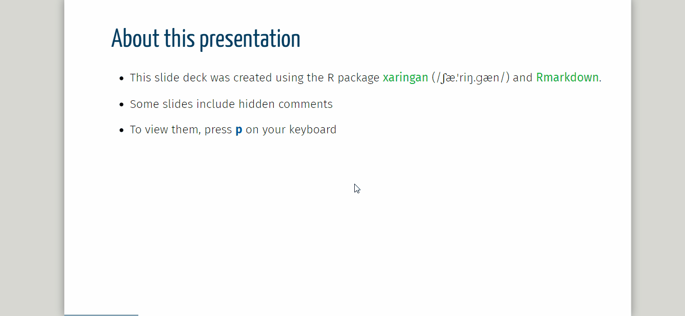
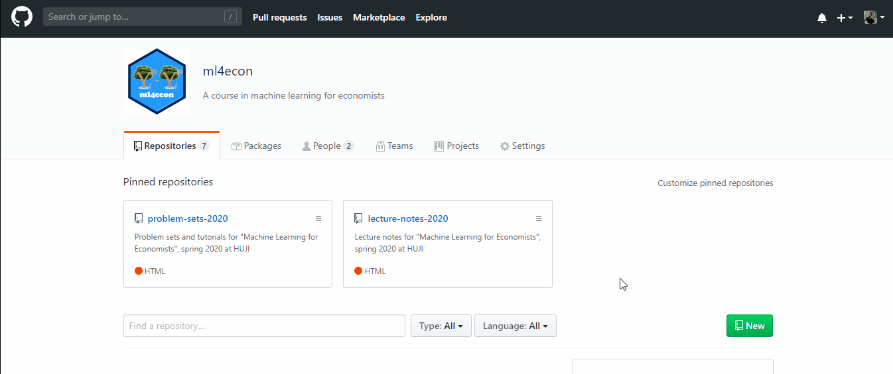
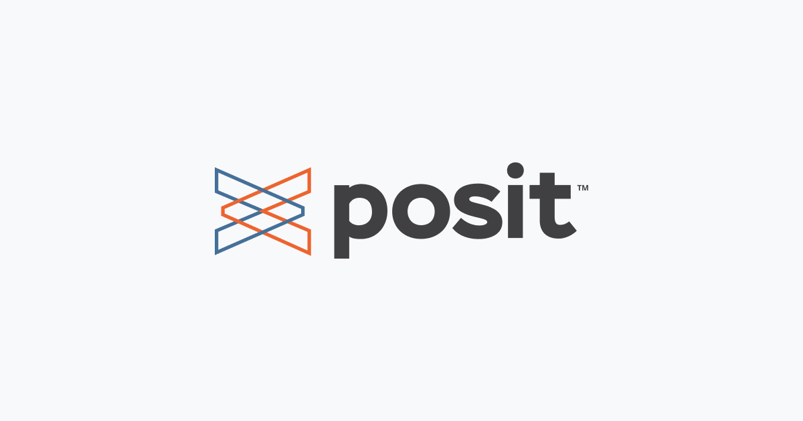
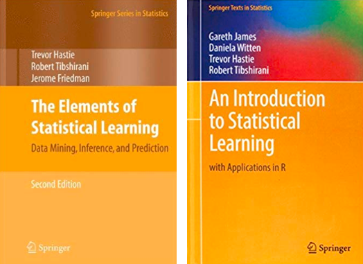
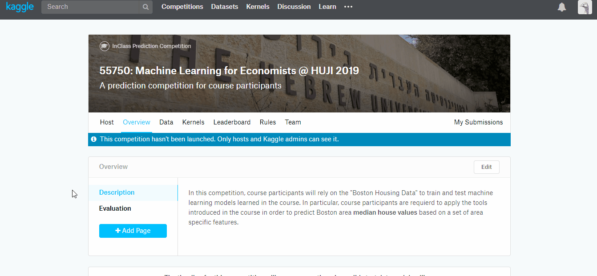

```{r setup, include=FALSE}
options(htmltools.dir.version = FALSE)

knitr::opts_chunk$set(eval = TRUE,
               echo = TRUE,
               warning = FALSE,
               message = FALSE,
               cache = FALSE)

htmltools::tagList(rmarkdown::html_dependency_font_awesome())
```

```{r plots_and_figures, include=FALSE}
library(ggplot2)
library(kableExtra)

theme_set(theme_gray(15))
```

```{r, references, echo=FALSE, cache=FALSE}
library(RefManageR)
BibOptions(check.entries = FALSE, 
           bib.style = "numeric", 
           cite.style = "authoryear", 
           style = "markdown",
           hyperlink = FALSE, 
           dashed = FALSE)
bib <- ReadBib("refs/refs.bib", check = FALSE)
```


# An aside: about the structure of these slides

- The course's slide decks are created using the [xaringan](https://slides.yihui.name/xaringan/#44) (/ʃæ.'riŋ.ɡæn/) R package and [Rmarkdown](https://rmarkdown.rstudio.com/).

- Some slides include hidden comments. To view them, press __p__ on your keyboard

```{r, echo=FALSE, out.width = "80%", fig.align='center'}



```

???

Here is a comment


---

class: title-slide-section-gray

# Outline

1. [Logistics](#logistics)  

2. [About the Course](#about)

3. [To Do List](#todo)


---
class: title-slide-section-blue, center, middle
name: logistics

# Logistics


---
# ml4econ GitHub repository

The class's GitHub repository: [https://github.com/ml4econ](https://github.com/ml4econ)

```{r, echo=FALSE, out.width = "80%", fig.align='center'}



```

---
# Posit Cloud workspace

[Posit Cloud](https://posit.cloud/) is a hosted version of RStudio in the cloud that will make it easy for R and Python novices to learn data science and machine learning using R and Python.

```{r, echo=FALSE, out.width = "80%", fig.align='center'}



```


---

# People


- __Itamar Caspi__  
  - email: [caspi.itamar@gmail.com](mailto:caspi.itamat@gmail.com) 
  - homepage: [itamarcaspi.rbind.io](https://itamarcaspi.rbind.io/)
  
- __Inbar Avni (TA)__  
  - email: [inbar.avni@mail.huji.ac.il](inbar.avni@mail.huji.ac.il)


* Meeting hours: after class/zoom, on demand.


---

# Feedback


Your continuous feedback is important!


Please feel free to contact us by

  - email  

  - in person  

  - or open an issue in our discussion forum


---
class: title-slide-section-blue, center, middle
name: about


# About the Course

---
# Prerequisites

Econometrics
- Linear regression models and OLS estimation
- Statistical inference and hypothesis testing
- Endogeneity issues and instrumental variables

Mathematical Foundation
- Derivatives, partial derivatives, and basic optimization
- Matrices, vectors, eigenvalues/eigenvectors
- Random variables, probability distributions,expectations, Sampling distributions

Programming
- Some experience with R (or another programming language) is a plus
- Basic data manipulation and visualization skills
- Familiarity with statistical software packages

---
# Learning Objectives

By the end of this course, students will be able to:

- Apply machine learning methods to economic research problems, including prediction policy tasks and causal inference questions

- Implement and evaluate ML workflows with proper cross-validation, regularization, and model selection techniques

- Interpret ML results in economic contexts and understand when ML approaches complement or improve upon traditional econometric methods

---
# What This Course Is NOT About

This course deliberately excludes:

- Technical implementation details of advanced ML algorithms (we focus on application rather than algorithmic development)

- Deep theoretical foundations of ML methods (we emphasize practical understanding over mathematical proofs)

- Cutting-edge techniques like generative AI, reinforcement learning, or computer vision (we concentrate on established methods with proven economic applications)


---

# Tentative schedule

| Week                  | Topic                                      |
|:----------------------|:-------------------------------------------|
| [**1**](#week-1)      | Course Overview & ML Basics                |
| [**2**](#week-2)      | Reproducibility and ML Workflow            |
| [**3**](#week-3)      | Regression and Regularization              |
| [**4**](#week-4)      | Classification                             |
| [**5**](#week-5)      | Non-parametrics                            |
| [**6**](#week-6)      | Unsupervised Learning                      | 
| [**7**](#week-7)      | Text analysis                              |
| [**8**](#week-7)      | Causal Inference                           |
| [**9**](#week-8)      | Lasso and Average Treatment Effects        |
| [**10**](#week-9)     | Trees and Heterogeneous Treatment Effects  |
| [**11**](#week-10)    | Prediction Policy Problems                 |
| [**12**](#week-11)    | Large Language Models                      |


> __NOTE__: This schedule can (and probably will) go through changes!


---

# Where to Start?

- [Big Data: New Tricks for Econometrics](https://www.aeaweb.org/articles?id=10.1257/jep.28.2.3) by Varian (2014)
_Journal of Economic Perspectives_, 28(2), 3-28.

- [The impact of machine learning on economics](https://www.nber.org/chapters/c14009.pdf) by Athey (2018)  
In _The Economics of Artificial Intelligence: An Agenda_.  
University of Chicago Press.   

- [Machine learning: an applied econometric approach](https://www.aeaweb.org/articles?id=10.1257/jep.31.2.87) by Mullainathan and Spiess (2017) 
_Journal of Economic Perspectives_, 31(2), 87-106.  

- [Machine Learning Methods That Economists Should Know About](https://www.annualreviews.org/content/journals/10.1146/annurev-economics-080217-053433) by Athey and Imbens (2019)
_Annual Review of Economics_, 11(1), 685-725.

- [Deep Learning for Economists](https://www.aeaweb.org/articles?id=10.1257/jel.20241733) by Dell (2025)
_Journal of Economic Literature_, 60(1), 3-63.

---

# Readings on ML

> All materials and lecture notes will be available on the [course repo](https://ml4econ.github.io/course-spring2023/lectures.html).

.pull-left[

There are __no__ required textbooks. A couple of suggestions:

- [An Introduction to Statistical Learning with Applications in R/Python (ISLR), 2 ed.](https://www.statlearning.com/)  
James et al. (2023)
__PDF available online__ 

- [The Elements of Statistical Learning (ELS)](https://hastie.su.domains/ElemStatLearn/download.html)  
`r Citet(bib, "hastie2009elements")`  
__PDF available online__  

]

.pull-right[

```{r books, echo=FALSE, out.width = "100%", fig.align='center'}



```

]


---

# Readings on ML and Econometrics

> All materials and lecture notes will be available on the [course repo](https://ml4econ.github.io/course-spring2023/lectures.html).

There are __no__ required textbooks.  

A couple of suggestions:

- [Applied Causal Inference Powered by ML and AI](https://causalml-book.org/), by Chernozhukov et al. (2024)
__PDF available online__  

- [Econometrics, Ch. 29](https://www.ssc.wisc.edu/~bhansen/econometrics/), by Hansen (2023)
__PDF available online__  

- [Bussiness Data Science](https://www.amazon.com/Business-Data-Science-Combining-Accelerate/dp/1260452778) by Taddy (2019)
_Available on Amazon_  


---

# More resources

Can be found at our GitHub repo:

[https://github.com/ml4econ/lecture-notes-2025/blob/master/resources.md](https://github.com/ml4econ/lecture-notes-2020/blob/master/resources.md)


---

# Programming


* Two of the most popular open-source programming languages for data science:  

  - [<i class="fab fa-r-project"></i>](https://www.r-project.org/)  
  
  - [<i class="fab fa-python"></i> Python](https://www.python.org/)  

* This course: Mostly R. Why? 
  - Widely used in academia.  
  - Great for data manipulation and visualization.  
  - Excellent for econometrics.  
  - Great for machine learning.  
  - Great for reproducibility.

*  We do encourage you to try out Python. However, **I** will only be able to provide limited support for Python users. Inbar on the other hand, will be able to provide more support.


---

# Catching up with R

If you are new to R, here are some resources to get you started:

* [R for Data Science](https://r4ds.had.co.nz/) is a great book to learn R and data science.

* [Posit Recipes](https://posit.cloud/learn/recipes) is a great (old school) resource to learn R.

* [DataCamp](https://www.datacamp.com/) is a great resource to learn R (and Python).


---

# GenAI

We encourage you to use AI (Claude, ChatGPT, Gemini, etc.) in this course, as it is an **essential skill to acquire**.

It is important you understand the (current) limitations of AI and its implications for economic research:

- Prompt engineering is necessary for quality outcomes.
- Always assume that it is wrong.
- Acknowledge its use in assignments and explain what prompts were used.

A useful resources:

- Read ["Generative AI for Economic Research: Use Cases and Implications for Economists"](https://www.aeaweb.org/articles?id=10.1257/jel.20231736) by Korinek (2023 JEL). Check for the latest version.


---

# Grading

Assignments:

- Submit 4 out of a total of 6 Problem sets.


Two projects: 

- Kaggle prediction competition.

- Conduct a replication study based on one of the datasets included in the [experimentdatar](https://itamarcaspi.github.io/experimentdatar/) package, or a paper of your choice.

.center[
__GRADING:__ Assingments __20%__, kaggle __30%__, project __50%__.
]

???

* One of your tasks in this course will be a [Kaggle](https://www.kaggle.com) competition. In this competition, you will rely on the “Boston Housing Data” to train and test machine learning models learned in the course. In particular, you will be required to apply the tools introduced in the course in order to predict ... [website](https://www.kaggle.com/t/97eb0edcbe7c406882c7c067076bedd3).
  

---

# Kaggle

```{r kaggle, echo=FALSE, out.width = "100%", fig.align='center'}



```


---
class: title-slide-section-blue, center, middle
name: todo

# To Do List

---

# Homework

<i class="fas fa-check-square"></i> Download and install [Git](https://git-scm.com/downloads). 
* Git is a version control system that will help you keep track of your code and collaborate with others.

<i class="fas fa-check-square"></i> Download and install [R and RStudio](https://posit.co/download/rstudio-desktop/).
* R is a programming language and environment for statistical computing and graphics. RStudio is an integrated development environment (IDE) for R.

<i class="fas fa-check-square"></i> Create an account on [GitHub](http://github.com/)
* GitHub is a platform for hosting and collaborating on code.

<i class="fas fa-check-square"></i> Download and install [GitHub Desktop](https://desktop.github.com/).
* GitHub Desktop is a graphical user interface for GitHub.


---
class: .title-slide-final, center, inverse, middle

# `slides |> end()`

[<i class="fa fa-github"></i> Source code](https://github.com/ml4econ/lecture-notes-2025/blob/master/01-overview/01-overview.Rmd)  

---
# References

```{r, 'refs', results='asis', echo=FALSE, eval=TRUE}
PrintBibliography(bib)
```

