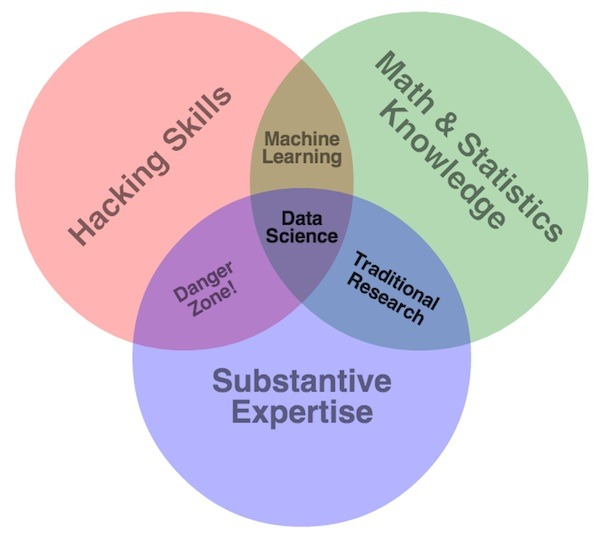
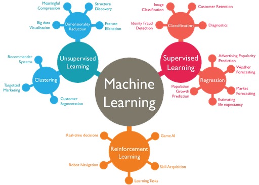
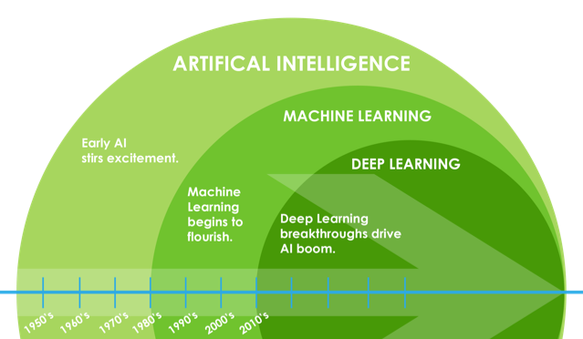
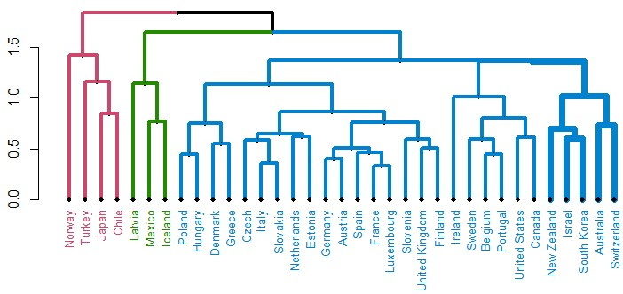
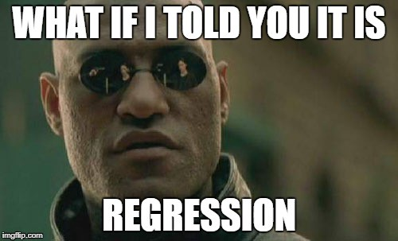
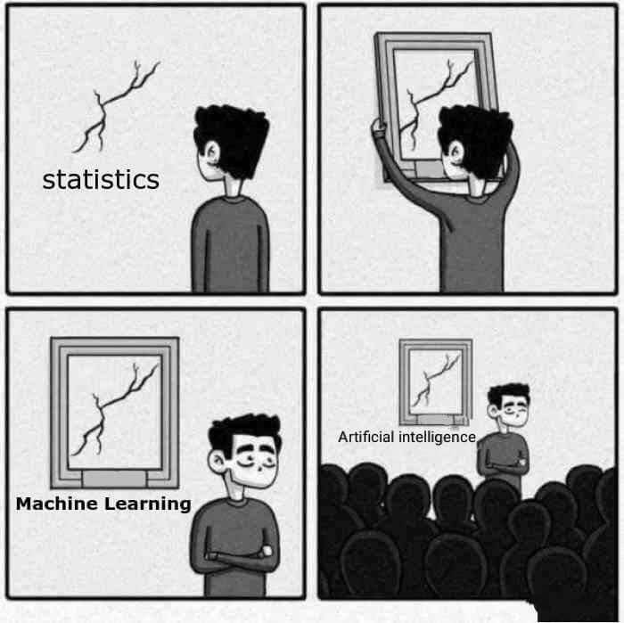
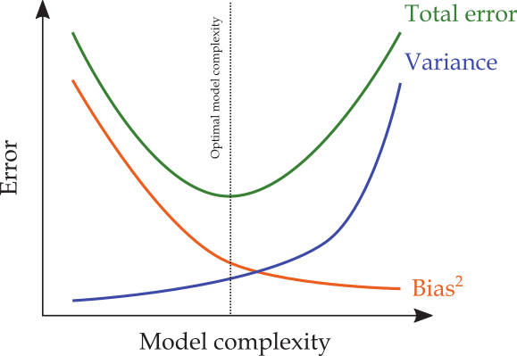
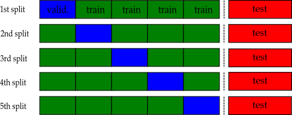

```{r setup, include=FALSE}
options(htmltools.dir.version = FALSE)
knitr::opts_chunk$set(eval = TRUE,
               echo = TRUE,
               warning = FALSE,
               message = FALSE,
               cache = FALSE,
               dev = "svglite",
               fig.ext = ".svg")

#htmltools::tagList(rmarkdown::html_dependency_font_awesome())
```

# Replicating this Presentation

R packages used to produce this presentation:

```{r packages, message=FALSE, warning=FALSE}
library(tidyverse)    # for data manipulation, exploration, and visualization using ggplot2, dplyr, etc.
library(tidymodels)   # for machine learning modeling using a consistent framework
library(RefManageR)   # for managing and formatting bibliographic references
library(truncnorm)    # for generating random numbers from truncated normal distributions
library(dagitty)      # for creating and analyzing directed acyclic graphs (DAGs) for causal inference
library(knitr)        # for dynamic report generation and embedding graphics
```


```{r ggplot_theme, include=FALSE}
theme_set(theme_gray(20))
```


```{r references, eval=TRUE, echo=FALSE, cache=FALSE}
BibOptions(check.entries = FALSE, 
           bib.style = "numeric", 
           cite.style = "authoryear", 
           style = "markdown",
           hyperlink = TRUE, 
           dashed = FALSE)
bib <- ReadBib("refs/refs.bib", check = FALSE)
```


---
# First Things First: "Big Data"

<midd-blockquote>"_A billion years ago modern homo sapiens emerged. A billion minutes ago, Christianity began. A billion seconds ago, the IBM PC was released.
A billion Google searches ago ... was this morning._"  
.right[Hal Varian (2013)]</midd-blockquote>

Today, we are at **~9 billion** Google searches per day!

The 4 Vs of big data:  

+ Volume - Scale of data.  
+ Velocity - Analysis of streaming data.  
+ Variety - Different forms of data.  
+ Veracity - Uncertainty of data.  

---

# "Data Science"

```{r, echo=FALSE, out.width = "50%", fig.align='center'}




```
[*] Hacking $\approx$ coding


---
# Outline

1. [What is ML?](#concepts)  

2. [The problem of overfitting](#overfitting)  

3. [Too complext? Regularize!](#regularization)  

4. [ML and Econometrics](#economics)  


---
class: title-slide-section-blue, center, middle
name: concepts

# What is ML?


---
# So, what is ML?

A concise definition by `r Citet(bib, "athey2018the")`:

<midd-blockquote>
"...[M]achine learning is a field
that develops algorithms designed to be applied to datasets, with the main areas of focus being prediction (regression), classification, and clustering or grouping tasks."
</midd-blockquote>

Specifically, there are three broad classifications of ML problems:  

  + supervised learning.  
  + unsupervised learning.  
  + reinforcement learning.  
  

> Most of the hype you hear about in recent years relates to supervised learning, and in particular, deep learning.


---


```{r, echo=FALSE, out.width = "80%", fig.align='center'}



```


???

Source: [https://wordstream-files-prod.s3.amazonaws.com/s3fs-public/machine-learning.png](https://wordstream-files-prod.s3.amazonaws.com/s3fs-public/machine-learning.png)


---
# An Aside: ML and Artificial Intelligence (AI)


```{r, echo=FALSE, out.width = "70%", fig.align='center'}



```


???

Source: [https://www.magnetic.com/blog/explaining-ai-machine-learning-vs-deep-learning-post/](https://www.magnetic.com/blog/explaining-ai-machine-learning-vs-deep-learning-post/)


---
# Unsupervised Learning

In _unsupervised_ learning, the goal is to divide high-dimensional data into clusters that are __similar__ in their set of features $(X)$.

Examples of algorithms:  
  - principal component analysis
  - $k$-means clustering
  - Latent Dirichlet Allocation (LDA) 
  
Applications:  
  - image recognition
  - cluster analysis
  - topic modelling


---
# Example: Clustering OECD Inflation Rates

```{r, echo=FALSE, out.width = "80%", fig.align='center'}



```

.footnote[_Source_: [Baudot-Trajtenberg and Caspi (2018)](https://www.bis.org/publ/bppdf/bispap100_l.pdf).]


---
# Reinforcement Learning (RL)
 
A definition by `r Citet(bib, "sutton2018rli")`:

<midd-blockquote>
_"Reinforcement learning is learning what to do—how to map situations to actions—so as to maximize a numerical reward signal. The learner is not told which actions to take, but instead must discover which actions yield the most reward by trying them."_
</midd-blockquote>


Prominent examples:

- Game AI (e.g., chess, AlphaGo).

- Robotics (e.g., autonomous cars).

- LLMs (e.g., ChatGPT)

---
# Supervised Learning

Consider the following data generating process (DGP):

$$Y=f(\boldsymbol{X})+\epsilon$$
where $Y$ is the outcome variable, $\boldsymbol{X}$ is a $1\times p$-dimensional vector of predictor variables (features), $f(⋅)$ is the unknown true relationship we aim to estimate, and $\epsilon$ is the irreducible error.  
- __Training set__ ("in-sample"): $\{(x_i,y_i)\}_{i=1}^{n}$ - used to fit the model
- __Test set__ ("out-of-sample"): $\{(x_i,y_i)\}_{i=n+1}^{m}$ - used to evaluate model performance
```{r, echo=FALSE, out.width = "50%", fig.align='center'}


```
<midd-blockquote>
Key assumptions: (1) independent observations; (2) consistent data generating process across both training and test sets.
</midd-blockquote>

---

# The Goal of Supervised Learning

The objective is to learn a function $\hat{f}(X)$ from a labeled training set (where both $X$ and $Y$ are known) that accurately predicts outcomes on unseen data (where only $X$ is known).

Specifically, we aim to:
- Minimize the generalization error (error on unseen data)
- Create a model that captures the true underlying relationship $f(X)$, not just memorize training examples


---
# Example: Spam Detection

```{r, echo=FALSE, out.width = "100%", fig.align='center'}

include_graphics("figs/spam.png")

```

In this case:
- $Y \in\{s p a m, h a m\}$ (a binary classification problem)
- $X$ represents the email's features (text, sender information, timestamp, location, etc.)
- The model learns patterns from labeled emails to identify spam in new, unseen emails

The challenge lies in identifying features that consistently distinguish spam across both seen and unseen emails, while avoiding overfitting to peculiarities in the training data.
---

# Traditional vs. Modern Approach to Supervised Learning

<iframe width="100%" height="400" src="https://www.youtube.com/embed/xl3yQBhI6vY?start=405" frameborder="0" allow="accelerometer; autoplay; encrypted-media; gyroscope; picture-in-picture" allowfullscreen></iframe>

---
# Traditional vs. Modern Approach to Supervised Learning

#### Traditional Approach: Expert-Defined Rules
- Human experts manually create rules based on domain knowledge
 - Example: For spam detection, create dictionaries of suspicious terms
 - Rules: "If email contains 'Nigerian Prince' AND unknown sender, classify as spam"
- Limitations: Labor-intensive, difficult to adapt, struggles with complex cases

#### Modern Approach: Data-Driven Learning
- System automatically discovers patterns from labeled examples
 - Underlying rules emerge from the data itself
 - Example: Feed algorithms thousands of labeled emails to identify patterns
- Advantages: Discovers non-obvious relationships, adapts to new patterns, 
 scales to handle complexity beyond human comprehension


---
# Real-World Applications of Machine Learning

| Task                    | Outcome (Y)                 | Features (X)                                 | Type                |
|-------------------------|-----------------------------|--------------------------------------------|---------------------|
| Credit scoring          | Probability of default      | Loan history, payment records, income      | Regression          |
| Fraud detection         | Fraud / no fraud            | Transaction patterns, timing, amounts      | Classification      |
| Sentiment analysis      | Positive / negative / neutral | Text, review content, linguistic features  | Classification      |
| Image classification    | Object categories           | Pixel values, image features               | Classification      |
| Overdraft prediction    | Yes / no                    | Account history, transaction patterns      | Classification      |
| Customer churn          | Will churn / won't churn    | Usage patterns, demographics, history      | Classification      |
| Disease diagnosis       | Disease presence/type       | Medical images, patient data, symptoms     | Classification      |

---
# Example: Anticipatory Package Shipping

Different applications involve different types of data structures, problem formulations, and evaluation metrics, each requiring specialized modeling approaches.

> Amazon's ["Anticipatory Package Shipping"](https://pdfpiw.uspto.gov/.piw?docid=08615473&SectionNum=1&IDKey=28097F792F1E&HomeUrl=http://patft.uspto.gov/netacgi/nph-Parser?Sect1=PTO2%2526Sect2=HITOFF%2526p=1%2526u%2025252Fnetahtml%2025252FPTO%20=%25%25%25%25%2025252Fsearch%20bool.html%202526r-2526f%20=%20G%20=%201%25%20=%2050%25%202526l%25%202526d%25%20AND%202526co1%20=%20=%20=%20PTXT%202526s1%25%25%25%20252522anticipatory%20252Bpackage%25%20=%25%20252522%25%202526OS%20252522anticipatory%20252Bpackage%25%25%20252%20522%25%202526RS%20252522anticipatory%25%20=%25%20252522%25%20252Bpackage) patent (December 2013): Imagine Amazon's algorithms reaching such levels of accuracy, casing it to change its business model from shopping-then-shipping to shipping-then-shopping!

???

A fascinating discussion on Amazon's shipping-then-shopping business model appears in the book ["Prediction Machines: The Simple Economics of Artificial Intelligence"](https://books.google.com/books/about/Prediction_Machines.html?id=wJY4DwAAQBAJ) `r Citep(bib, "agrawal2018prediction")`.

---
# Supervised Learning Algorithms: A Historical Perspective

Many core machine learning algorithms have surprisingly deep historical roots:
- Linear and logistic regression (1805, 1958)
  - The foundations of statistical modeling predating modern computing
- K-Nearest neighbors (1967)
  - An intuitive approach formalized in the era of early computing
- Decision trees (CART, ID3, 1984)
  - Emerged as computing power allowed more complex rule-based systems
- Neural networks (conceptualized 1940s, major advances 1986, 1990s)
  - Theoretical foundations existed decades before practical implementation
- Support vector machines (1990s)
  - Computational optimization applied to classification problems
- Ensemble methods (bagging 1996, Random Forests 2001, boosting 1990s)
  - Combining multiple models for improved performance

Most foundational algorithms were developed well before the recent "AI revolution," suggesting other factors must explain the current surge in ML capabilities.

---
# So, Why Now?

- ML methods have always been data-hungry and computationally expensive. The recent boom is driven by:
  - Exponential growth in available data (internet, IoT, digitization of services)
  - Dramatic advances in computing power (GPUs, cloud infrastructure)
  - Improved software and frameworks that democratize implementation
  
$$ \text{big data} + \text{computational advancements} = \text{the rise of ML}$$

- As Diebold notes:
<midd-blockquote> "_[S]upervised learning [...] may involve high dimensions, non-linearities, binary variables, etc., but at the end of the day it's still just regression._" .right[&mdash; [__Francis X. Diebold__](https://fxdiebold.blogspot.com/2018/06/machines-learning-finance.html)]</midd-blockqoute>

The core mathematical principles haven't changed significantly—what's changed is our ability to implement them at unprecedented scales.


```{r, echo=FALSE, out.width = "25%", fig.align='center'}



```

---
# Wait, is ML Just Glorified Statistics?

.pull-left[
```{r, echo=FALSE, out.width = "100%", fig.align='center'}



```
]

.pull-right[
The "two cultures" `r Citep(bib, "breiman2001statistical")`:

**Statistics**: Assumes a data generating process and focuses on parameter estimation, inference, and understanding underlying mechanisms with strong emphasis on model assumptions and interpretability.

**Machine learning**: Treats the data mechanism as unknown and complex, focusing primarily on prediction accuracy and generalization performance with less concern for interpretable structures or theoretical guarantees.
]


???

See further discussions here:

- [https://towardsdatascience.com/no-machine-learning-is-not-just-glorified-statistics-26d3952234e3](https://towardsdatascience.com/no-machine-learning-is-not-just-glorified-statistics-26d3952234e3)  

- [https://www.quora.com/Is-Machine-Learning-just-glorified-statistics](https://www.quora.com/Is-Machine-Learning-just-glorified-statistics)


---
class: title-slide-section-blue, center, middle
name: overfitting

# Overfitting


---
# Prediction Accuracy

To precisely define what makes a prediction "good," we need a formal way to measure performance:

#### Loss Functions

- Let $(x^0,y^0)$ denote a single observation from the (unseen) **test set**
- A **loss function** $L(y^0, \hat{y}^0)$ quantifies the prediction error when $\hat{y}^0=\hat{f}(x^0)$
- The model $\hat{f}$ is estimated using only the **training** data

---
# Common Loss Functions

For regression:
- Squared error (SE): $L(y^0, \hat{y}^0)=(y^0-\hat{y}^0)^2$ 
  - Penalizes large errors more heavily; sensitive to outliers
- Absolute error (AE): $L(y^0, \hat{y}^0)=|y^0-\hat{y}^0|$
  - More robust to outliers; constant penalty for increasing error

For classification:
- 0-1 loss: $L(y^0, \hat{y}^0)=I(y^0 \neq \hat{y}^0)$ (misclassification rate)
- Cross-entropy loss: $L(y^0, \hat{y}^0)=-\sum_c y^0_c \log(\hat{y}^0_c)$ (for probabilities)

The choice of loss function should reflect the specific costs of different types of prediction errors in your application.

---
# Intuition Behind the Bias-Variance Trade-off

Imagine you are a teaching assistant grading exams. You've just graded a student's first exam and got a score of 95. Now you need to predict their score on the second exam. Two possible approaches:

1. **Use only the first score (unbiased but variable):**
   + Using 95 as your prediction is unbiased (doesn't systematically under or overestimate)
   + But single exam scores vary greatly due to luck, daily preparation, etc.
   + High variance means your prediction could be far off

2. **Shrink toward the class average (biased but less variable):**
   + If the class average is 75, you might predict (75 + 95)/2 = 85
   + This introduces bias (systematically predicting lower than 95)
   + But reduces variance since you're not fully relying on a single, noisy observation

**Key insight:** By accepting a small amount of bias, we can significantly reduce variance, often resulting in better overall predictions.

Let's simulate this to see which approach performs better in practice!

???

This example is taken from Susan Athey's AEA 2018 lecture, ["Machine Learning and Econometrics"](https://www.aeaweb.org/conference/cont-ed/2018-webcasts) (Athey and
Imbens).

---
# The Bias-Variance Decomposition

Under a __squared error loss function__, an optimal predictive model is one that minimizes the _expected_ squared prediction error.  

It can be shown that if the true model is $Y=f(X)+\epsilon$, then

$$\begin{aligned}[t]
\mathbb{E}\left[\text{SE}^0\right] &= \mathbb{E}\left[(y^0 - \hat{f}(x^0))^2\right] \\ &= \underbrace{\left(\mathbb{E}(\hat{f}(x^0)) - f(x^0)\right)^{2}}_{\text{bias}^2} + \underbrace{\mathbb{E}\left[\hat{f}(x^0) - \mathbb{E}(\hat{f}(x^0))\right]^2}_{\text{variance}} + \underbrace{\mathbb{E}\left[y^0 - f(x^0)\right]^{2}}_{\text{irreducible error}} \\ &= \underbrace{\mathrm{Bias}^2 + \mathbb{V}[\hat{f}(x^0)]}_{\text{reducible error}} + \sigma^2_{\epsilon}
\end{aligned}$$

where the expectation is over the training set _and_ $(x^0,y^0)$.


---
# Understanding the Expectation Operator in Bias-Variance

The expectation $\mathbb{E}[\text{SE}^0]$ integrates over two sources of randomness:

1. **Randomness in the training data**: Different training sets $\mathcal{D} = \{(x_i, y_i)\}_{i=1}^n$ lead to different fitted models $\hat{f}_\mathcal{D}(x)$

2. **Randomness in the test point**: The specific test point $(x^0, y^0)$ we evaluate on

This gives us:
$$\mathbb{E}[\text{SE}^0] = \mathbb{E}_{\mathcal{D}, (x^0,y^0)}\left[(y^0 - \hat{f}_\mathcal{D}(x^0))^2\right]$$

---
# Exam Grade Prediction Simulation

Let's Draw 1000 grade duplets from the following truncated normal distribution

$$g_i \sim truncN(\mu = 75, \sigma = 15, a=0, b=100),\quad i=1,2$$

Next, calculate two types of predictions
  - `unbiased_pred` is the first exam's grade.
  - `shrinked_pred` is an average of the previous grade and a _prior_ mean grade of 70.

```{r, echo=FALSE}

n <- 1000 # number of replications

test_df <- tibble(attempt = 1:n,
                  grade1  = rtruncnorm(n, a = 0, b = 100, mean = 80, sd = 15),
                  grade2  = rtruncnorm(n, a = 0, b = 100, mean = 80, sd = 15)) %>% 
  mutate_if(is.numeric, round, 0) %>% 
  mutate(unbiased_pred = grade1,
         shrinked_pred = 0.5*70 + 0.5*grade1)
  
```

Here a small sample from our simulated table:
```{r, echo=FALSE}
kable(sample_n(test_df, 5), format = "html")
```

---
# The Distribution of Predictions

```{r, echo=FALSE, fig.width=11, fig.height=5, fig.align='center'}

test_df %>% 
  select(attempt, unbiased_pred, shrinked_pred) %>% 
  gather(guess_type, guess_value, -attempt) %>% 
  ggplot(aes(x = guess_value, fill = guess_type)) +
  geom_histogram(binwidth = 5, show.legend = FALSE) +
  facet_wrap(~ guess_type) +
  labs(x = "Test Score", y = "Count")
  
```

---

# The MSE of Grade Predictions

```{r, echo=FALSE}
test_df %>% 
  mutate(unbiased_SE = (unbiased_pred - grade2)^2,
         shrinked_SE = (shrinked_pred - grade2)^2) %>% 
  summarise(unbiased_MSE = mean(unbiased_SE),
            shrinked_MSE = mean(shrinked_SE)) %>% 
  kable(format = "html")
```


Hence, the shrunk prediction turns out to be better (in the sense of MSE) then the unbiased one!

__QUESTION:__ Is this a general result? Why?


---
# Illustrating Bias-Variance: The Consumption Function

- Let's see the bias-variance tradeoff in action with a practical economic example

- Consider a classic consumption function relationship:
  $$consumption_i = \beta_0 + \beta_1 \times income_i + \varepsilon_i$$

- We'll explore three modeling approaches with varying complexity:
  1. **Underfitting**: Too simple (high bias, low variance)
  2. **Overfitting**: Too complex (low bias, high variance)
  3. **"Just right"**: Optimal complexity balance

- This will show how different economists might approach the same data differently


---
# The "Experiment"

.half-box[
**Our Experiment:**
- Three economists (A, B, C) each receive a different subset of consumption data
- All data comes from the same "true" model
- Each economist must predict consumption at income = 70 (outside their observed range)
- We'll compare their approaches with different model complexities
]

**Step 1: Simulate the DGP:**
```{r cons_data}

set.seed(1505) # for replicating the simulation

df <- crossing(economist = c("A", "B", "C"),
         obs = 1:20) %>% 
  mutate(economist = as.factor(economist)) %>% 
  mutate(income = rnorm(n(), mean = 100, sd = 10)) %>% 
  mutate(consumption = 10 + 0.5 * income + rnorm(n(), sd = 10))
```

---
# Scatterplot of the Data

.pull-left[
```{r scatter, fig.show='hide', fig.retina=3}

df %>% 
  ggplot(aes(y = consumption,
             x = income)) +
  geom_point() +
  geom_vline(xintercept = 70, linetype = "dashed")

  
```
]
.pull-right[
```{r, ref.label = 'scatter', echo=FALSE}

```
]
---
# Split the Sample Between the Three Economists

.pull-left[
```{r scatter_split, fig.show='hide', fig.retina=3}

df %>% 
  ggplot(aes(y = consumption,
             x = income,
             color = economist)) +
  geom_point() +
  geom_vline(xintercept = 70, linetype = "dashed")

  
```

```{r cons_table}

knitr::kable(sample_n(df,6), format = "html")

```
]
.pull-right[
```{r, ref.label = 'scatter_split', echo=FALSE}

```
]

---
# Underffiting: High Bias, Low Variance


.pull-left[
The model: unconditional mean

$$Y_i = \beta_0+\varepsilon_i$$
```{r underfit, fig.width=6, fig.show='hide', fig.retina=3}

df %>% 
  ggplot(aes(y = consumption,
             x = income,
             color = economist)) +
  geom_point() +
  geom_smooth(method = lm,
              formula = y ~ 1, #<<
              se = FALSE,
              color = "black") +
  facet_wrap(~ economist) +
  geom_vline(xintercept = 70, linetype = "dashed") +
  theme(legend.position = "bottom")
  
```
]
.pull-right[
```{r, ref.label = 'underfit', echo=FALSE}

```
]
---
# Overfitting: Low Bias, High Variance

.pull-left[
The model: high-degree polynomial

$$Y_i = \beta_0+\sum_{j=1}^{\lambda}\beta_jX_i^{\lambda}+\varepsilon_i$$

```{r overfit, fig.width=6, fig.show='hide', fig.retina=3}

df %>% 
  ggplot(aes(y = consumption,
             x = income,
             color = economist)) +
  geom_point() +
  geom_smooth(method = lm,
              formula = y ~ poly(x,5), #<<
              se = FALSE,
              color = "black") +
  facet_wrap(~ economist) +
  geom_vline(xintercept = 70, linetype = "dashed") +
  theme(legend.position = "bottom")
  
```
]
.pull-right[
```{r, ref.label = 'overfit', echo=FALSE}

```
]

---
# "Justfitting": Bias and Variance are Just Right

.pull-left[
The model: linear regression

$$Y_i = \beta_0+\beta_1 X_i + \varepsilon_i$$

```{r justfit, fig.width=6, fig.show='hide', fig.retina=3}

df %>% 
  ggplot(aes(y = consumption,
             x = income,
             color = economist)) +
  geom_point() +
  geom_smooth(method = lm,
              formula = y ~ x, #<<
              se = FALSE,
              color = "black") +
  facet_wrap(~ economist) +
  geom_vline(xintercept = 70, linetype = "dashed") +
  theme(legend.position = "bottom")
  
```
]
.pull-right[
```{r, ref.label = 'justfit', echo=FALSE}

```
]
---
# The Typical Bias-Variance Trade-off in ML


Typically, ML models strive to find levels of bias and variance that are "just right":

```{r, echo=FALSE, out.width = "60%", fig.align='center'}



```


---
# When is the Bias-Variance Trade-off Important?

In low-dimensional settings ( $n\gg p$ )  
  + Overfitting risk decreases as $n$ grows
  + Training MSE approximates test MSE more closely
  + Conventional tools (e.g., OLS) often perform adequately
  + *BUT:* Bias-variance tradeoff still matters with limited samples

INTUITION: As $n\rightarrow\infty$, model parameters converge to their true values.

In high-dimensional settings ( $n\ll p$ )  
  + Overfitting becomes almost inevitable
  + Training MSE significantly underestimates test MSE
  + Regularization becomes essential (LASSO, ridge, elastic net)
  + Feature selection and dimensionality reduction gain importance
  

---
# Bias-Variance Trade-off in Low-dimensional Settings

.pull-left[
The model is a 3rd degree polynomial

$$Y_i = \beta_0+\beta_1X_i+\beta_2X^2_i+\beta_3X_i^3+\varepsilon_i$$

only now, the sample size for each economist increases to $N=500$.

> __INTUITION:__ as $n\rightarrow\infty$, $\hat{\beta}_2$ and $\hat{\beta}_3$ converge to their true value, zero.

```{r big_n_data, echo=FALSE}
set.seed(1505)
df <- crossing(economist = c("A", "B", "C"),
         obs = 1:500) %>% 
  mutate(economist = as.factor(economist)) %>% 
  mutate(income = rnorm(n(), mean = 100, sd = 10)) %>% 
  mutate(consumption = 10 + 0.5 * income + rnorm(n(), sd = 10))
```

```{r big_n_plot, echo=FALSE, fig.width=6, fig.height=3, fig.show='hide', fig.retina=3}
df %>% ggplot(aes(y = consumption,
             x = income,
             color = economist)) +
  geom_point() +
  geom_smooth(method = lm,
              formula = y ~ poly(x,3), #<<
              se = FALSE,
              color = "black") +
  facet_wrap(~ economist) +
  geom_vline(xintercept = 70, linetype = "dashed") +
  theme(legend.position = "bottom")


```
]
.pull-right[
```{r, ref.label = 'big_n_plot', echo=FALSE}

```
]


---
class: title-slide-section-blue, center, middle
name: regularization

# Regularization


---
# Regularization: Directly Controlling Model Complexity

- The bias-variance tradeoff shows that *increased complexity* often leads to overfitting
  
- **Regularization** explicitly penalizes model complexity during training
  - Adds a complexity penalty to the loss function
  - Forces the model to balance fitting training data with staying simple
  
<midd-blockquote>
Regularization typically results in models that are mathematically "wrong" but predict more accurately.
</midd-blockquote>

---
# How to Detect Overfitting Without a Test Set?

The test set MSE is *unobservable* during model development. Our solution:

- **Create our own "mini test sets"** from the training data
  - Split available data into training and validation portions
  - Train on one part, evaluate on another

- **Why this works:** 
  - Under the stable DGP assumption, the validation set approximates future data
  - Allows us to estimate out-of-sample error before seeing actual test data
  
- This approach leads naturally to **cross-validation** techniques


---
# Validation

.pull-left[
Split the sample into three distinct sets: a training set, a validation set and a test set:

```{r, echo=FALSE, out.width = "100%", fig.align='center'}


```
The validation process:
1. Fit a model to the training set
2. Use the model to predict outcomes from the validation set
3. Calculate validation MSE to approximate the test-MSE
4. Once model selection is complete, evaluate on the final test set
]

.pull-right[
The validation error is calculated as:
$$\text{V-MSE} = \frac{1}{n_v}\sum_{i \in \mathcal{V}}(y_i - \hat{f}(x_i))^2$$
where $\mathcal{V}$ is the validation set of size $n_v$.


**CONCERNS**: 
1. Sensitive to the specific training-validation split
2. Does not use all available information for training
3. Reduces effective sample size for model fitting
]

---
# k-fold Cross-validation

.pull-left[
Split the training set into $k$ roughly equal-sized parts ( $k=5$ in this example):


```{r, echo=FALSE, out.width = "100%", fig.align='center'}



```

Approximate the test-MSE using the mean of $k$ split-MSEs:
$$\text{CV-MSE} = \frac{1}{k}\sum_{j=1}^{k}\text{V-MSE}_j$$
]

.pull-right[
**Key advantages:**
1. Uses all available data for both training and validation
2. Reduces sensitivity to particular data splits
3. Provides a more robust estimate of out-of-sample performance
4. Each observation is used for both training and validation

**Common choices for $k$:**
- $k=5$ or $k=10$ are typical
- $k=n$ is called "leave-one-out" cross-validation
]


---
# Cross-Validation and the Bias-Variance Tradeoff

- Cross-validation helps us estimate the *expected* test error by simulating multiple training-test splits
- This directly relates to our bias-variance decomposition:
  $$\mathbb{E}[\text{SE}^0] = \mathrm{Bias}^2 + \mathbb{V}[\hat{f}(x^0)] + \sigma^2_{\epsilon}$$

- The CV-MSE provides a practical estimate of $\mathbb{E}[\text{SE}^0]$ without requiring infinite training sets
- By varying model complexity and measuring CV-MSE, we can find the optimal bias-variance tradeoff


---
# Sample Counterparts in Practice

The CV-MSE approximates the expected test error from our bias-variance decomposition:

$$\text{CV-MSE} = \frac{1}{k}\sum_{j=1}^{k}\text{V-MSE}_j \approx \mathbb{E}[\text{SE}^0]$$

This works through two levels of approximation:

1. **Training set variation**: Each fold $j$ uses a different training set $\mathcal{D}_j$
   - This simulates drawing multiple training sets from the population
   - Helps capture variance in $\hat{f}(x^0)$ across different possible training data

2. **Test point averaging**: Within each fold, we average squared errors across validation points
   - This approximates the expectation over test points $(x^0,y^0)$
   

---
# Which Model to Choose?

.pull-left[
As model complexity increases:
- Bias typically decreases
- Variance typically increases
- CV-MSE helps us find the sweet spot

Hence, model selection amounts to choosing the complexity level that minimizes CV-MSE.

Recall that the test-MSE is unobservable, and CV-MSE is our best approximation to guide model selection.
]

.pull-right[
```{r, echo=FALSE, out.width = "100%", fig.align='center'}

```
]

---
# Sounds Familiar? Same Principle Different Approach

- The model selection principle behind CV-MSE connects to criteria you already know:  
  - **Adjusted R²**: Penalizes R² based on degrees of freedom
  - **AIC/BIC**: Balance goodness-of-fit with complexity penalties
  
- All use the same core idea: $\text{Criterion} = \text{Fit measure} + \text{Complexity penalty}$

- **Key distinction**: 
  - Traditional statistics use analytical formulas with theoretical penalties
  - ML uses cross-validation to let the data empirically determine optimal complexity
  - Both aim to avoid overfitting and improve generalization to new data

---
class: title-slide-section-blue, center, middle
name: economics

# ML and Causality


---
# ML vs. Econometrics: Key Distinctions

Apart from terminology differences, here are the fundamental contrasts:

|   Machine Learning   | Econometrics |
|:---------------------|:-------------|
| Focus on prediction $\hat{Y}$ | Focus on causal effects $\hat{\beta}$ |
| Optimize for out-of-sample accuracy | Optimize for parameter properties (unbiasedness, consistency) |
| Validation via prediction error | Validation via statistical significance |
| Requires stable environment | Enables counterfactual analysis |
| Often black-box approaches | Typically structural models |
| Question: "What will happen?" | Question: "What if we intervene?" |

> ML learns correlations in data; econometrics identifies causal mechanisms.

---
# ML and Causal Inference: The Fundamental Challenge

<midd-blockquote> *"Data are profoundly dumb about causal relationships."*   
.right[&mdash; [__Pearl and Mackenzie, *The Book of Why*__](http://bayes.cs.ucla.edu/WHY/)]
</midd-blockquote> 

**Why econometrics can't be replaced by ML:** 
Intervention fundamentally violates the stable DGP assumption that ML relies on:

$$P(Y|X=x) \neq P(Y|do(X=x)),$$

where:
- $P(Y|X=x)$ is the probability of $Y$ given that we *observe* $X=x$ (prediction)  
- $P(Y|do(X=x))$ is the probability of $Y$ given that we *intervene* to set $X=x$ (causal effect)

> While ML excels at the first equation, econometric methods are designed to estimate the second.

---
# From Prediction to Causation: A Simple Example

.pull-left[

**EXAMPLE:** An ML algorithm finds that `coffee` consumption is a strong predictor of `dementia`. Based on this correlation, should we recommend avoiding coffee?


```{r dag1, fig.length=1, fig.show='hide', echo = FALSE}

library(ggdag)

coffee_dag <- dagify(
       dementia ~ coffee,
       exposure = "dementia",
       outcome = "coffee",
       labels = c("dementia" = "Dementia", "coffee" = "Coffee")
       ) %>% 
  tidy_dagitty(layout = "tree")

ggdag(coffee_dag, text = FALSE,
      text_size = 8, use_labels = "label")

```
]
.pull-right[
```{r, ref.label = 'dag1', echo=FALSE}

```
]

???

---
# To Explain or to Predict? 

.pull-left[
- Despite being a good *predictor*, `coffee` has no causal effect on `dementia`
- The correlation exists because both are influenced by an underlying factor: `addictive` behavior
- `Smoking` is the actual causal factor for `dementia`

> This illustrates why ML's predictive power doesn't translate directly to policy effectiveness. The $P(Y|X=x) \neq P(Y|do(X=x))$ distinction is not just theoretical—it has practical implications.


```{r dag2, fig.length=1, fig.show='hide', echo = FALSE}

library(ggdag)

coffee_dag <- dagify(dementia ~ smoking,
       smoking ~ addictive,
       coffee ~ addictive,
       exposure = "coffee",
       outcome = "dementia",
       labels = c("coffee" = "Coffee", "dementia" = "Dementia", 
                  "smoking" = "Smoking", "addictive" = "Addictive \n behavior")) %>% 
  tidy_dagitty(layout = "tree")

ggdag(coffee_dag, text = FALSE,
      text_size = 8, use_labels = "label")

```
]
.pull-right[
```{r, ref.label = 'dag2', echo=FALSE}

```
]

???

The title of this slide "To Explain or to Predict?" is the name of a must-read [paper](https://projecteuclid.org/euclid.ss/1294167961) by `r Citet(bib, "shmueli2010explain")` that clarifies the distinction between predicting and explaining.

---
# ML in Aid of Econometrics

Consider the standard causal inference problem:

$$Y_i=\alpha+\underbrace{\tau D_i}_{\text{causal parameter}} +\underbrace{f(X_i)}_{\text{confounding factors}}+\varepsilon_i,\quad\text{for }i=1,\dots,n$$

where:
+ $Y_i$ is the outcome variable
+ $D_i \in \{0,1\}$ is the treatment indicator
+ $X_i$ is a potentially high-dimensional vector of control variables
+ $\tau$ is our target: the average treatment effect (ATE)


---
# ML in Aid of Econometrics

Consider the standard causal inference problem:

$$Y_i=\alpha+\underbrace{\tau D_i}_{\text{causal parameter}} +\underbrace{f(X_i)}_{\text{confounding factors}}+\varepsilon_i,\quad\text{for }i=1,\dots,n$$

**Key insight:** We can decompose this problem into:
1. **Causal identification** (econometrics): Ensuring $\tau$ has a causal interpretation
2. **Nuisance estimation** (machine learning): Modeling complex relationships in $f(X_i)$

**Why this matters:**
- When $p$ is large (many controls), traditional methods struggle
- ML excels at modeling $f(X_i)$ without strong functional form assumptions
- This hybrid approach allows us to focus on causal parameter $\tau$ while letting ML handle the high-dimensional prediction task


---
class: .title-slide-final, center, inverse, middle

# `slides |> end()`

[<i class="fa fa-github"></i> Source code](https://github.com/ml4econ/lecture-notes-2025/blob/master/02-basic-ml-concepts/02-basic-ml-concepts.Rmd)  

---
# References

```{r, 'refs1', results='asis', echo=FALSE, eval=TRUE}
PrintBibliography(bib, start = 1, end = 6)
```

---
# References

```{r, 'refs2', results='asis', echo=FALSE, eval=TRUE}
PrintBibliography(bib, start = 6, end = 7)
```

