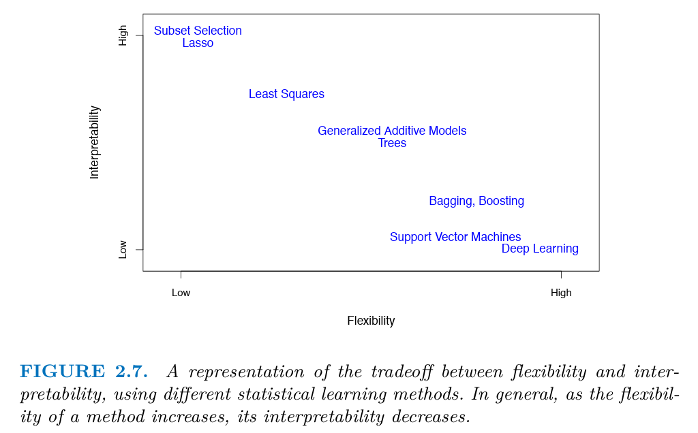

```{r setup, include=FALSE}
options(htmltools.dir.version = FALSE)
knitr::opts_chunk$set(
  eval = TRUE,
  echo = TRUE,
  warning = FALSE,
  message = FALSE,
  cache = FALSE,
  dev = "svglite",
  fig.ext = ".svg")

htmltools::tagList(rmarkdown::html_dependency_font_awesome())
```


# Packages and setup

We will use the following packages during the presentation:
```{r load_pack, message=FALSE, warning=FALSE, eval=TRUE}

library(tidyverse)   # for data wrangling and visualization
library(tidymodels)  # for data modeling
library(GGally)      # for pairs plot
library(skimr)       # for summary statistics
library(here)        # for referencing folders and files

```

For the presentation, we will select a specific `ggplot` theme (not relevant otherwise):
```{r ggplot_theme}
theme_set(theme_grey(20))
```


---
# The `tidymodels` package

.pull-left[
```{r tidymodels_logo, echo=FALSE, out.width = "80%", fig.align='center'}

```
]
.pull-right[

>"[`tidymodels`](https://github.com/tidymodels/tidymodels) is a "meta-package" for modeling and statistical analysis that share the underlying design philosophy, grammar, and data structures of the tidyverse."

[GET STARTED](https://www.tidymodels.org/start/)
]


---
# Supervised Machine Learning Workflow

1. [Define the Prediction Task](#background)

2. [Explore the Data](#eda)

3. [Set Model and Tuning Parameters](#model)

4. [Perform Cross-Validation](#cv)

5. [Evaluate the Model](#eval)


---
class: title-slide-section-blue, center, middle
name: background

# Step 1: Define the Prediction Task


---

# The `BostonHousing` dataset️

.pull-left[
- Dataset: 506 census tracts from the 1970 Boston census (Harrison & Rubinfeld, 1978)

- The authors examined how air pollution and proximity to the Charles River affected housing prices.

- They quantified how much residents were willing to pay for cleaner air—a key early example of valuing environmental amenities.

]
.pull-right[
```{r boston_pic, echo=FALSE, out.width = "1000%", fig.align='center'}

```
Source: [https://www.bostonusa.com/](https://www.bostonusa.com/)
]

---

# A bird's-eye view of Boston

```{r boston_air, echo=FALSE, out.width = "80%", fig.align='center'}
knitr::include_graphics("https://media.wbur.org/wp/2019/11/1125_bosheatmap-2-1000x510.jpg")
```
Source: [https://www.wbur.org/news/2019/11/25/heat-mapping-boston-museum-of-science](https://www.wbur.org/news/2019/11/25/heat-mapping-boston-museum-of-science)


---
# Load the Data

We will use the `read_csv()` function to import the raw dataset.
```{r load_data, message=FALSE}
boston_raw <- read_csv(here("03-ml-workflow/data","BostonHousing.csv"))

boston_raw |> head(5)
```

---
# Variables in the Dataset

.pull-left[
* `crim` – Per capita crime rate by town
* `zn` – Proportion of residential land zoned for lots over 25,000 sq. ft.
* `indus` – Proportion of non-retail business acres per town
* `chas` – Charles River dummy variable (= 1 if tract bounds river; 0 otherwise)
* `nox` – Nitric oxides concentration (parts per 10 million)
* `rm` – Average number of rooms per dwelling
* `age` – Proportion of owner-occupied units built prior to 1940
]
.pull-right[
* `dis` – Weighted distances to five Boston employment centers
* `rad` – Index of accessibility to radial highways
* `tax` – Full-value property tax rate per $10,000
* `ptratio` – Pupil-teacher ratio by town
* `b` – 1000(Bk - 0.63)^2, where Bk is the proportion of Black residents by town
* `lstat` – % lower status of the population
* **`mdev` – Median value of owner-occupied homes in $1000s**
]

---
# What Type of Data?

For a better understanding of the data structure, apply the `glimpse()` function:
```{r glimpse}
glimpse(boston_raw)
```

The `chas` variable predominantly consists of zeros, which implies that it should be treated as a categorical factor.

---
# Our Task


**Components**

- `medv` (target): Median home value in thousands of dollars
- `lstat` (predictor): Percentage of lower status population
- `chas` (predictor): Proximity to Charles River (1 = yes, 0 = no)

**Objective** 

- Predict `medv` based on the given predictors

**Model**

- Polynomial regression: $medv_i = \beta_0 + \sum_{j=1}^{\lambda}\beta_j lstat_i^j+\varepsilon_i$

---
# Initial Data Filtering

Select `medv` and `lstat` 
```{r filter_data}
boston <- boston_raw %>% 
  as_tibble() %>% 
  select(medv, lstat, chas) %>% 
  mutate(chas = as_factor(chas))

head(boston)
```


---
class: title-slide-section-blue, center, middle
name: split

# Step 2: Split the Data


---
# Initial Split 

To perform an initial train-test split, we will use the `initial_split()`, `training()`, and `testing()` functions from the [rsample](https://tidymodels.github.io/rsample/) package.

Remember to set a seed for reproducibility.
```{r seed}
set.seed(1203) 
```

Initial split:
```{r initial_split}
boston_split <- boston %>% 
  initial_split(prop = 2/3, strata = medv)

boston_split
```

---
# Preparing Training and Test Sets

```{r train_test_raw}
boston_train_raw <- training(boston_split)
boston_test_raw  <- testing(boston_split)

head(boston_train_raw, 5)
```


```{r head_test_raw}
head(boston_test_raw, 5)
```

---
class: title-slide-section-blue, center, middle
name: eda

# Step 3: Explore the Data

---
# Summary Statistics Using `skimr`

```{r skimr, eval=FALSE}
boston_train_raw %>% 
  skim()
```

(Not visually appealing on these slides)


---
# Pairs Plot Using `GGally`

.pull-left[

We will now create a __pairs plot__, which efficiently displays every variable in a dataset against all the others.
```{r pairs, fig.width=6, fig.show='hide', fig.retina=3}
boston_train_raw %>% ggpairs()
```
]
.pull-right[
```{r, ref.label = 'pairs', echo=FALSE}

```
]
 
---
# Select a Model

.pull-left[

We will select the class of polynomial models, represented as follows:

$$medv_i = \beta_0 + \sum_{j=1}^{\lambda}\beta_j lstat_i^j+\varepsilon_i$$
```{r poly, fig.width=6, fig.show='hide', fig.retina=3}

boston_train_raw %>% ggplot(aes(lstat, medv)) +
  geom_point() +
  geom_smooth(
    method = lm,
    formula = y ~ poly(x,1),
    se = FALSE,
    color = "blue"
  ) +
  geom_smooth(
    method = lm,
    formula = y ~ poly(x,10),
    se = FALSE,
    color = "red"
  )
```
]

.pull-right[
In blue $\lambda=1$; in red, $\lambda = 10$.
```{r, ref.label = 'poly', echo=FALSE}

```
]
 
 
---
class: title-slide-section-blue, center, middle
name: model

# Step 4: Set Model and Tuning Parameters


---

# Data Preprocessing using `recipes`

The `recipes` package is an excellent resource for data preprocessing, seamlessly integrating with the tidy approach to machine learning.

```{r recipe}
boston_rec <- 
  recipe(medv ~ lstat + chas, data = boston_train_raw) %>% 
  step_poly(lstat, degree = tune("lambda")) %>% 
  step_dummy(chas)

boston_rec
```

Explanation of the code:
- `recipe()`: Create a recipe object that specifies the target and predictors and the training data
- `step_poly()`: Apply polynomial transformation to `lstat`
- `step_dummy()`: Convert `chas` to a dummy variable

---
# Set a Grid for $\lambda$

What are the tuning parameters we need to consider?

```{r params}
boston_rec %>% extract_parameter_set_dials()
```

We must tune the polynomial degree parameter $(\lambda)$ while constructing our models using the training data. In this example, we will establish a range between 1 and 8:
```{r grid}
lambda_grid <- expand_grid("lambda" = 1:8)
```

---
# Define the Model

Using the linear regression model:
```{r model}

lm_mod <- linear_reg()%>%
  set_engine("lm")

lm_mod
```
Note that in this case, there are no tuning parameters involved.


---
class: title-slide-section-blue, center, middle
name: cv

# Step 5: Cross-validation


---
# Split the Training Set to 5-folds

We will apply the `vfold_cv()` function from the [rsample](https://tidymodels.github.io/rsample/) package to divide the training set into 5-folds:
```{r cv_split}
cv_splits <- boston_train_raw %>% 
  vfold_cv(v = 5)
  
cv_splits
```


---
# Define the Workflow

Next, we define a `workflow()` that combines a model specification with a recipe or model preprocessor.
```{r workflow}
boston_wf <- 
  workflow() %>%
  add_model(lm_mod) %>%
  add_recipe(boston_rec)
```

Note that in this case, there are no tuning parameters involved.

---
# Estimate CV-RMSE Over the $\lambda$ Grid

We will now calculate the cross-validated root mean squared error (CV-RMSE) for each value of $\lambda$.
```{r tune}
boston_results <- 
  boston_wf %>% 
  tune_grid(
  resamples = cv_splits,
  grid      = lambda_grid
)

boston_results
```

---
# Find the Optimal $\lambda$

Let's identify the top-3 best-performing models.
```{r rmse}
 boston_results %>% 
  show_best(metric = "rmse", n = 3)
```

<midd-blockquote> _"[I]n reality there is rarely if ever a true underlying model, and even if there was a true underlying model, selecting that model will not necessarily give the best forecasts..."_ .right[&mdash; [__Rob J. Hyndman__](https://robjhyndman.com/hyndsight/crossvalidation/)] </midd-blockquote>


---
# And Now Using a Graph

.pull-left[
```{r cv_plot, echo=TRUE, fig.width=6, fig.show='hide', fig.retina=3}
boston_results %>% 
  autoplot()
```
]
.pull-right[
```{r, ref.label = 'cv_plot', echo=FALSE}

```

]

---
class: title-slide-section-blue, center, middle
name: eval

# Step 6: Evaluate the Model


---

# Use the Test Set to Evaluate the Best Model

Choose the optimal value of $\lambda$
```{r best_lambda}
best_lambda <- boston_results %>% 
  select_best(metric = "rmse")

best_lambda
```

Create a recipe using the optimal $\lambda = 6$
```{r prep}
boston_final <- boston_rec %>% 
  finalize_recipe(best_lambda)
```


---
# Apply the Recipe to the Training and Test Sets

The `juice()` function applies the recipe to the training set, while the `bake()` function applies it to the test set.
```{r test_train}
boston_train <- boston_final %>% 
  prep() %>% 
  juice()

boston_test <- boston_final %>% 
  prep() %>% 
  bake(new_data = boston_test_raw)
```

For instance, let's examine the training set:
```{r head_train}
head(boston_train, 3)
```

---

# Fit the Model to the Training Set

Fit the optimal model (with $\lambda = 6$) to the training set:
```{r fit}
boston_fit <- lm_mod %>% 
  fit(medv ~ ., data = boston_train)
```

The following are the estimated coefficients:
```{r broom_fit}
boston_fit %>% tidy()
```


---
# Make Predictions Using the Test Set

Generate a tibble that includes the predictions and the actual values:
```{r pred}
boston_pred <- boston_fit %>% 
  predict(new_data = boston_test) %>%   #<<
  bind_cols(boston_test) %>% 
  select(medv, .pred)

head(boston_pred)
```

It's worth noting that this is the first time we are utilizing the test set!

---
# Test-RMSE

Calculate the root mean square error (RMSE) for the test set (test-RMSE):
```{r test_rmse}
boston_pred %>% 
  rmse(medv, .pred)
```
The above is a measure of our model's performance on "general" data.

<midd-blockquote>__NOTE:__ The test set RMSE estimates the predicted squared error on unseen data, provided the best model.</midd-blockquote>

---
# Always plot your prediction errors

.pull-left[

Plotting the prediction errors $(y_i-\hat{y}_i)$ against the target variable provides critical information regarding prediction quality.
```{r resid, fig.width=6, fig.show='hide', fig.retina=3}

boston_pred %>% 
  mutate(resid = medv - .pred) %>% 
  ggplot(aes(medv, resid)) +
  geom_point() +
  geom_hline(yintercept = 0, color = "red")

```
For example, our predictions for high-end levels of `medv` are highly biased, indicating that there's potential for improvement...

]

.pull-right[
```{r, ref.label = 'resid', echo=FALSE}

```
]

---
# (A shortcut)

The `last_fit()` function from `tune` is a much quicker way to obtain the test-set RMSE. 

Firstly, we need to modify our workflow to utilize the optimal $\lambda$ value.
```{r, eval=TRUE}
boston_wf <- 
  workflow() %>%
  add_model(lm_mod) %>%
  add_recipe(boston_final)  #<<
```

We will now use the optimal model to estimate the out-of-sample RMSE.
```{r, eval=TRUE}
boston_wf %>% 
  last_fit(split = boston_split) %>%  #<<
  collect_metrics() %>% 
  filter(.metric == "rmse")
```

---
class: title-slide-section-blue, center, middle
name: eval

# Extensions


---
# Feature Engineering

.pull-left[
We could enhance with additional transformations, for example:

**Interaction terms** between status and location:
   $$medv_i = \beta_0 + \beta_1 lstat_i + \beta_2 chas_i$$ $$+ \beta_3 \cdot (lstat_i \times chas_i) + \varepsilon_i$$
]

.pull-right[
```{r feature_viz, echo=FALSE, fig.width=6, fig.height=4.5, fig.retina=3}
# Visualization of interaction effect
boston_train_raw %>%
  ggplot(aes(x = lstat, y = medv, color = chas)) +
  geom_point(alpha = 0.7) +
  geom_smooth(method = "lm", se = FALSE) +
  scale_color_manual(
    values = c("0" = "darkgrey", "1" = "darkblue"),
    labels = c("Not on Charles River", "On Charles River")
  ) +
  labs(
    title = "",
    x = "lstat",
    y = "Median Home Value",
    color = "Location"
  ) +
  theme(legend.position = "bottom")
```
]

<midd-blockquote>Feature engineering represents the convergence of economic theory and data science - this is where domain expertise significantly impacts model performance.</midd-blockquote>

---
# Learning Curves: Real Data Diagnostics

.pull-left[
```{r learning_curves_setup, echo=FALSE, eval=TRUE}
# Function to compute learning curves for a specific lambda
compute_learning_curve <- function(lambda_val, data) {
  prop_range <- seq(0.2, 0.8, by = 0.1)
  
  model_rec <- recipe(medv ~ lstat + chas, data = data) %>% 
    step_poly(lstat, degree = lambda_val) %>% 
    step_dummy(chas)
  
  lm_mod <- linear_reg() %>% set_engine("lm")
  
  wf <- workflow() %>%
    add_model(lm_mod) %>%
    add_recipe(model_rec)
  
  map_dfr(prop_range, function(prop) {
    set.seed(123)
    small_split <- initial_split(data, prop = prop)
    small_train <- training(small_split)
    small_test <- testing(small_split)
    
    fit <- wf %>% fit(data = small_train)
    
    bind_rows(
      predict(fit, small_train) %>% 
        bind_cols(small_train) %>%
        rmse(medv, .pred) %>%
        mutate(Error_Type = "Training", 
               Training_Size = nrow(small_train),
               Lambda = lambda_val),
      predict(fit, small_test) %>% 
        bind_cols(small_test) %>%
        rmse(medv, .pred) %>%
        mutate(Error_Type = "Validation", 
               Training_Size = nrow(small_train),
               Lambda = lambda_val)
    )
  })
}
```
**Learning curves** provide critical model diagnostics by showing:
* High-degree $(\lambda=10)$: Low training/high validation error; high variance
* Linear $(\lambda=1)$: Close errors but both high; high bias
* Optimal $(\lambda=6)$: Balanced bias/variance; approaches best performance
]

.pull-right[
```{r plot_learning_curves, echo=FALSE, fig.width=6, fig.height=4.5, fig.align='center', fig.retina=3}
set.seed(1203)
learning_curves <- bind_rows(
  compute_learning_curve(1, boston),
  compute_learning_curve(6, boston),
  compute_learning_curve(10, boston)
)

learning_curves %>%
  mutate(Model = case_when(
    Lambda == 1 ~ "Linear (λ=1)",
    Lambda == 6 ~ "Optimal (λ=6)",
    Lambda == 10 ~ "High-degree (λ=10)"
  )) %>%
  mutate(Model = factor(Model, levels = c("High-degree (λ=10)", 
                                        "Linear (λ=1)", 
                                        "Optimal (λ=6)"))) %>%
  ggplot(aes(x = Training_Size, y = .estimate, 
             color = Error_Type, linetype = Error_Type)) +
  geom_line(size = 1) +
  geom_point(size = 2) +
  facet_wrap(~Model) +
  theme_minimal(12) +
  scale_color_manual(values = c("Training" = "blue", "Validation" = "red")) +
  labs(
    title = "Learning Curves for Polynomial Models",
    x = "Training Set Size",
    y = "RMSE",
    color = "Error Type",
    linetype = "Error Type"
  ) +
  theme(legend.position = "bottom")
```

]

<midd-blockquote>Learning curves inform both model selection and data collection strategies—more data only helps if variance (overfitting) is the primary issue.</midd-blockquote>

---

# Predict vs Explain (vs. Intervene)

.pull-left[
**Polynomial “Black Box”**  
- Captures complex, non-linear effects  
- Coefficients are not directly interpretable  
- Often needs post-hoc visualization  

**Transparent Models**  
- Linear regressions offer constant marginal effects  
- Directly link predictors to outcomes  
- Easier to communicate in economic terms  

**None of the above guarantee causal interpretation**
]
.pull-right[
```{r tradeoff, echo=FALSE, , out.width = "100%", fig.align='center'}

```
]

---
class: .title-slide-final, center, inverse, middle

# `slides |> end()`

[<i class="fa fa-github"></i> Source code](https://github.com/ml4econ/lecture-notes-2025/tree/master/03-ml-workflow)  


