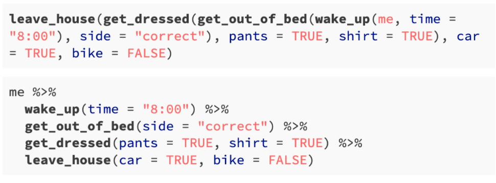
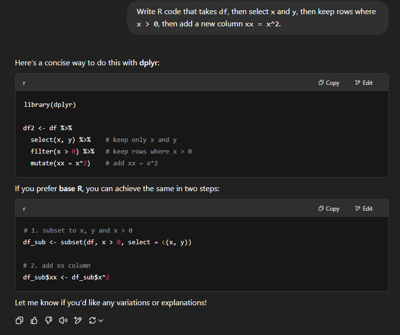
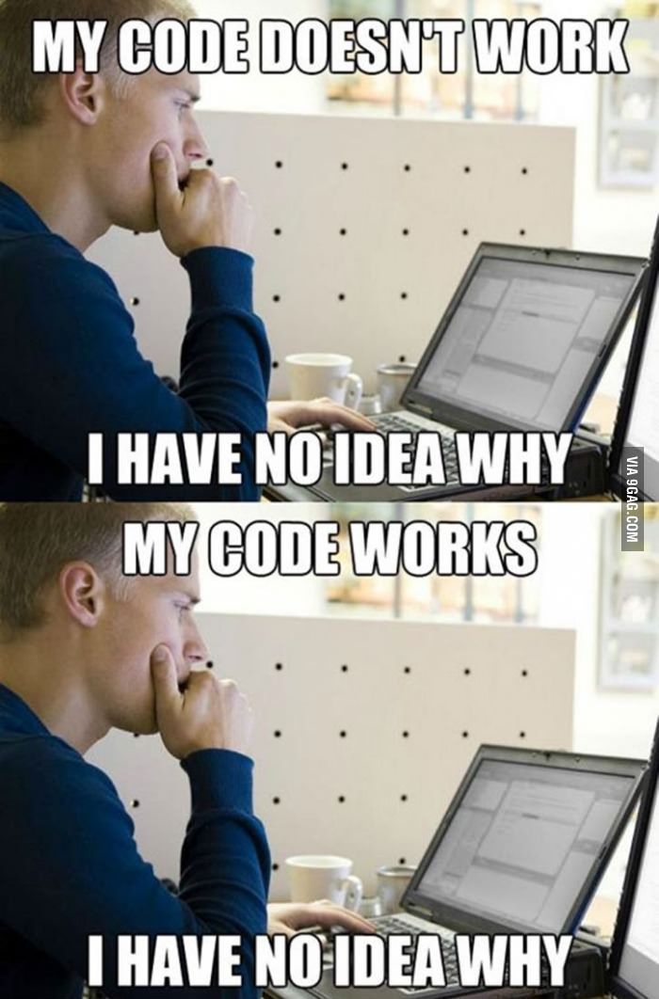

# Replicating this Presentation

R packages used to produce this presentation

```{r load packages, message=FALSE, warning=FALSE}
library(tidyverse)  # for data wrangling and plotting
library(tidymodels) # for modeling the tidy way
library(knitr)      # for presenting tables
library(xaringan)   # for rendering xaringan presentations
```


```{r setup, include=FALSE}
options(htmltools.dir.version = FALSE)

knitr::opts_chunk$set(
  eval    = TRUE,
  echo    = TRUE,
  warning = FALSE,
  message = FALSE
)

htmltools::tagList(rmarkdown::html_dependency_font_awesome())
```

```{r plots_and_figures, include=FALSE}
theme_set(theme_gray(15))
```


---

# From Best Practices to Research Methodology

Good research isn’t just about the right model or dataset—it’s about building a system where your entire process is transparent, reproducible, and scalable. We’re not just replacing tools; we’re redefining methodology

| Traditional Best Practice           | Modern Methodological Approach           |
|:------------------------------------|:-----------------------------------------|
| High-dimensional statistics         | Machine learning                         |
| Inline code comments                | Literate programming (Notebooks: Rmd, Jupyter) |
| `mydoc_1_3_new_final_23.docx`       | Version control (Git, GitHub/GitLab)     |
| Manually curated Excel tables       | Programmatically generated tables (SQL, dplyr, pandas) |
| Ad hoc scripts and file sharing     | Fully reproducible workflows (e.g., Make, Snakemake, R targets) |
| Stata, SAS, EViews                  | R, Python, Julia                         |
| Working in isolation                | Interdisciplinary, collaborative teams   |

---
# Why This Matters

Modern research demands more than good analysis.

✅ Transparent  
✅ Reproducible  
✅ Collaborative  
✅ Scalable

We're moving from ad hoc habits to **engineered workflows**.  
Not just new tools — a new **research methodology**.


---

# Outline

1. [Reproducibility](#projects)

2. [The Tidyverse](#tidyverse)

3. [Version Control](#git)

4. [GitHub](#github)


---
class: title-slide-section-blue, center, middle
name: projects

# RStudio Projects

---
# Reproducibility: From Principle to Practice

**Reproducible research**  
Enables *anyone* — including future-you — to re-run your code and get the same results.

**What it requires:**  
- Clear documentation (what you did *and* why)  
- All dependencies listed (packages, versions, data sources)  
- Environment details (e.g., R version, OS, random seeds)  

**Mindset shift:**  
Write for the *next person* who reads your code — especially if that person is you, six months from now.


---

# Robust Packages Use: `renv`

.pull-left[
```{r, echo=FALSE, out.width = "80%", fig.align='center'}
knitr::include_graphics("https://rstudio.github.io/renv/logo.svg")
```
]

.pull-right[

- **[`renv` package](https://rstudio.github.io/renv/index.html):** Create reproducible environments for R projects

- **Key benefits:**

  - *Isolated:* Private package library for each project
  - *Portable:* Easily transfer projects across computers and platforms
  - *Reproducible:* Records exact package versions for consistent installations
  
- **Learn more:** [Introduction to `renv`](https://rstudio.github.io/renv/articles/renv.html)

]


---

# RStudio Project-Oriented Workflow

**Avoid common anti-patterns:**
- `setwd()` — hardcodes paths and breaks portability
- `rm(list = ls())` — hides underlying issues in code structure

**Recommended practices:**

1. Use RStudio Projects  
   - Keeps all files relative to a self-contained working directory  
   - Supports portability and collaboration

2. Configure your R environment for reproducibility  
   - Go to: `Tools → Global Options → General`  
   - Set **“Save workspace to .RData on exit”** to **NEVER**  
   - Uncheck **“Restore .RData into workspace at startup”**

---
# Why Project-Oriented Workflows Matter

**1. Reproducibility**  
Your code should run from start to finish on any machine, with no manual tweaks.

**2. Transparency**  
Avoid hidden state and side effects — make your logic explicit and inspectable.

**3. Portability**  
Relative paths and project directories ensure your work is easily shared or moved.

**4. Collaboration**  
Team members (and your future self) can understand and run your project without reverse-engineering your environment.

**5. Version control compatibility**  
Project-based organization plays well with Git, enabling clean tracking of changes and smooth collaboration.

---
# R Markdown: A Tool for Reproducible Research

- Integrates text, code, figures, tables, and citations in one document  

- Always starts from a clean R session when “knitted” — ensures reproducibility
- Outputs to multiple formats:
  - Documents: HTML, PDF, Word
  - Presentations: Beamer, PowerPoint, Xaringan
  - Websites, books, articles, dashboards (`blogdown`, `bookdown`, `pagedown`, `flexdashboard`)

- Ideal for communicating analysis, sharing workflows, and creating dynamic documents

- A modern alternative: [**Quarto**](https://quarto.org)  
  - Supports R, Python, Julia; more flexible and extensible


---
class: title-slide-section-blue, center, middle
name: tidyverse

# The Tidyverse


---
# This is Not a Pipe

```{r pipe, echo=FALSE, out.width = "50%", fig.align='center'}

knitr::include_graphics("figs/pipe.jpg")

```


---

# `%>%` Is a Pipe

- `%>%` is the *pipe operator* from the `magrittr` package (core to the `tidyverse`)
- It passes the result of one function into the next — like saying **“and then”**

**Example (equivalent code):**

Traditional:
`y <- h(g(f(x), z))`

Piped version:
`y <- x %>% f() %>% g(z) %>% h()`

**Read as:**
“Take `x`, then apply `f()`, then apply `g()` with `z`, then apply `h()` — save as `y`”

This expresses a series of transformations **in the order you think about them**, improving both readability and debugging.


---
# Morning Routine

```{r pipe2, echo=FALSE, out.width = "80%", fig.align='center'}



```

Source: [https://twitter.com/andrewheiss/status/1359583543509348356?s=20](https://twitter.com/andrewheiss/status/1359583543509348356?s=20)

---

# Base R vs. the Tidyverse

Given this data frame:

```{r}
df <- data.frame(
  x = rnorm(10),
  y = rnorm(10),
  z = rnorm(10)
)
```
What does this base R code do?

```{r}
df_new <- df[df$x > 0, c("x", "y")]
df_new$xx <- df_new$x^2
```

Next: Let’s rewrite this with `dplyr` for clarity and readability.

---

# "Pipped" code?

How about this one?

```{r }
df_new <- df %>% 
  select(x, y) %>% 
  filter(x > 0) %>% 
  mutate(xx = x^2)
```


The above code chunk should be read as:

>"Take `df`, then select `x` and `y`, then keep rows where `x > 0`, then add a new column `xx = x^2`."

- The native pipe operator `|>` is available in R 4.1.0 and later

```{r }
df_new <- df |>  
  select(x, y) |> 
  filter(x > 0) |> 
  mutate(xx = x^2)
```

---
# Pros & Cons

- Adopting a **tidyverse** approach improves readability ⇒ and with it, **reproducibility**

- There’s a growing consensus in the R community that we should [**learn the tidyverse first**](http://varianceexplained.org/r/teach-tidyverse/)

- But: the tidyverse is **utopian by design** - It evolves rapidly in pursuit of elegance and consistency

- Base R, by contrast, is **stable and enduring** - Built to last — sometimes clunky, but reliable

- **Bottom line:** Be fluent in both — tidy tools for clarity, base tools for durability


---
# Enter GenAI

.pull-left[

```{r , echo=FALSE, out.width = "100%", fig.align='center'}

```

]

.pull-right[

```{r chat, echo=FALSE, out.width = "65%", fig.align='center'}

```

]


---
# Vibe Coding

- **What is Vibe Coding?**  A term popularized by Andrej Karpathy, *vibe coding* is the practice of using natural language to prompt AI tools to generate code — letting you focus on "what" rather than "how."

- **How it works:**
  - Describe what you want in plain language
  - Let an AI assistant (like ChatGPT) generate the code
  - Test, refine, and adapt the output to fit your goals

- **Connection to Reproducibility:**
  - Pros: Accelerates the creation of reproducible scripts and pipelines  
  - Cons: Risks introducing opaque, unvalidated code if you're not critically engaged

- **Takeaway:**  Vibe coding is powerful — but only if paired with a solid understanding of workflows, data, and reproducibility principles. *Don’t just vibe — validate.*


---
# The Tidyverse

```{r tidyverse_pic, echo=FALSE, out.width = "100%", fig.align='center'}

knitr::include_graphics("figs/tidyverse.png")

```

---

# Tidyverse Packages

Which packages come with `tidyverse`?

```{r }

tidyverse_packages()

```

Note that not all these packages are loaded by default.

We now briefly introduce the tidyverse's flagship: `dplyr`.

---
# `dplyr`: The Grammar of Data Manipulation

**`dplyr` is the tidyverse toolkit for transforming data frames**  
Readable, consistent, and designed for pipelines.

**Core verbs:**
- `filter()` – keep rows that meet a condition  
- `select()` – pick columns by name  
- `mutate()` – add or transform columns  
- `arrange()` – sort rows  
- `summarise()` – reduce values to summaries

**Additional verbs:**
- `group_by()` – perform operations by group  
- `sample_n()` – randomly sample rows

[Complete `dplyr` reference ](https://dplyr.tidyverse.org/reference/index.html)


---

# The `tidymodels` package

- Tidymodels extends the tidyverse's "grammar" to modeling tasks.

```{r tidymodels}
tidymodels::tidymodels_packages()
```


For more information, visit the [tidymodels GitHub repo](https://github.com/tidymodels/tidymodels).


---

# Resources

1. [R for Data Science (r4ds, 2e)](https://r4ds.hadley.nz/) by Garrett Grolemund and Hadley Wickham.

2. [Data Visualiztion: A practical introduction](https://socviz.co/) by Kieran Healy.


---
class: title-slide-section-blue, center, middle
name: git

# Version Control


---

# Version Control

.pull-left[
```{r, echo=FALSE, out.width = "90%", fig.align='center'}

```
]

.pull-right[

### The "*_FINAL_v2_REALLY_FINAL_THIS_TIME.xlsx*" problem:

- What exactly changed?
- Where in the file?
- When was it edited?
- Who made the change?
- Why was it changed?

---

Without version control, **your data and code become a mystery.**

Let’s fix that.

]

---
# Git

.pull-left[
```{r, echo=FALSE, out.width = "80%", fig.align='center'}
knitr::include_graphics("https://git-scm.com/images/logos/downloads/Git-Icon-1788C.png")
```
]

.pull-right[

- **Git** is a *distributed version control system*.

- Sounds fancy? Think **"track changes"**, but for entire code projects.

- Git tracks every change, by every contributor, across time.

- It's the **de facto standard** for managing code, collaborating, and ensuring reproducibility.

- Git isn't just for code — it's used to track any plain text files. It's a foundational tool for reproducible research

]


---
# GitHub

.pull-left[
```{r, echo=FALSE, out.width = "90%", fig.align='center'}
knitr::include_graphics("https://github.githubassets.com/images/modules/logos_page/GitHub-Mark.png")
```
]

.pull-right[

- GitHub is a web-based platform for hosting Git repositories.

- It’s like Dropbox for Git projects — but with features for collaboration, issue tracking, and code review.

- GitHub builds on Git by making it easier to work with others and manage projects online.

- It's a key hub for open-source development, including many R packages and research tools.

]


???

The source for the definition of GitHub is [Wikipedia](https://en.wikipedia.org/wiki/GitHub).

---
# Git vs GitHub

> Git is the engine. GitHub is the garage.


.pull-left[
**Git**

- Version control system  
- Tracks changes locally  
- Runs in your terminal  
- Works without internet  
- Created by Linus Torvalds (2005)
]

.pull-right[
**GitHub**

- Hosting platform for Git repositories  
- Adds collaboration tools (issues, pull requests)  
- Web-based interface  
- Requires Git to function  
- Launched by GitHub, Inc. (2008)
]

---
# GitHub Desktop

.pull-left[
```{r, echo=FALSE, out.width = "90%", fig.align='center'}
knitr::include_graphics("https://carldesouza.com/wp-content/uploads/2020/03/img_5e72a64e32003.png")
```
]

.pull-right[

- [GitHub Desktop](https://desktop.github.com/) is a graphical interface for working with Git and GitHub.

- It lets you commit changes, manage branches, and sync with remote repositories — all without using the command line.

- It also supports pull requests, merge conflict resolution, and collaborative workflows.

]


---

# Resources

1. [Happy Git and GitHub for the useR](https://happygitwithr.com/) by Jenny Bryan.

2. [Version Control with Git(Hub)](https://raw.githack.com/uo-ec607/lectures/master/02-git/02-Git.html) by Grant McDerrmot.

3. [Pro Git](https://git-scm.com/book/en/v2) (hardcore).


---
class: title-slide-section-blue, center, middle
name: practice

# Workflow


---

# Suggested Workflow: Starting a New R Project with Git

- **In RStudio:**
  1. Open RStudio.  
  2. Go to *File → New Project → New Directory → New Project*.  
  3. Enter a name for your project under **Directory name**.  
  4. Check the box: **Create a git repository**.  
  5. Check the box: **Use renv with this project**.

- **In GitHub Desktop:**
  1. Open GitHub Desktop.  
  2. Go to *File → Add local repository*.  
  3. Select your newly created RStudio project folder as the **Local path**.  
  4. Click **Publish repository** to upload it to GitHub — choose public or private.

> Optional: add a `README.md` and a `.gitignore` file before publishing.


---

# Suggested Git Workflow (Optional)

- **Pull → Stage → Commit → Push**

  1. Open GitHub Desktop.
  2. Set the *Current repository* to your project.
  3. Click **Fetch origin**, then **Pull** to sync with the latest changes from GitHub.
  4. Open your project in RStudio (or your editor of choice).
  5. Make and save changes to one or more files.
  6. Review the changed files in GitHub Desktop.
  7. Select (stage) the files you want to include in the commit.
  8. Write a brief commit summary (and optional description).
  9. Click **Commit to main**.
  10. Click **Push origin** (or press `Ctrl + P`) to upload your changes to GitHub.

> Tip: Always pull before you push — avoid merge conflicts.


---
# Clone and Sync a Remote GitHub Repository (Optional)

- **Cloning a Repository:**
  1. Launch GitHub Desktop.
  2. Navigate to the remote repository.
  3. Select "Clone or download".
  4. Define the local path for your cloned repo (e.g., "C:/Documents/CLONED_REPO").

- **Synchronizing a Repository:**
  1. Launch GitHub Desktop.
  2. Switch "Current repository" to the cloned repo.
  3. Press the "Fetch origin" button.
  4. __Pull__ any updates made on the remote repo.


---
# Your Homework

- **Getting Started with R and Git:**
  1. Open RStudio.
  2. Create an R project.
  3. Initiate Git.<sup>1</sup>
  4. Create a new RMarkdown file.
  5. Commit your changes via GitHub Desktop.

  .footnote[
  <sup>1</sup> RStudio automatically generates a `.gitignore` file that tells Git which files to ignore. Click [here](https://raw.githack.com/uo-ec607/lectures/master/02-git/02-Git.html#57) for more details on configuring what to ignore.
  ]


---
class: .title-slide-final, center, inverse, middle

# `slides |> end()`


[<i class="fa fa-github"></i> Source code](https://github.com/ml4econ/lecture-notes-2025/tree/master/04-reprod-vc)  
