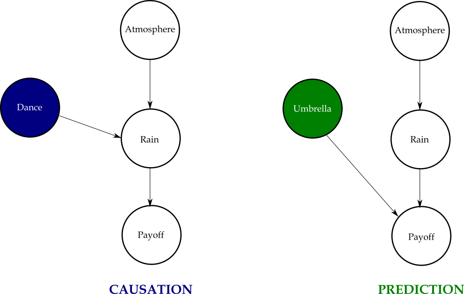
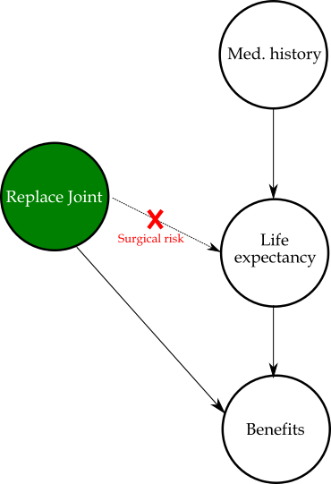
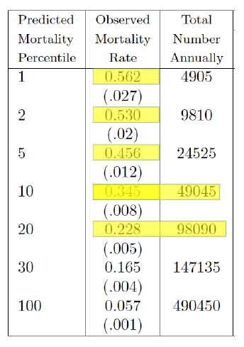
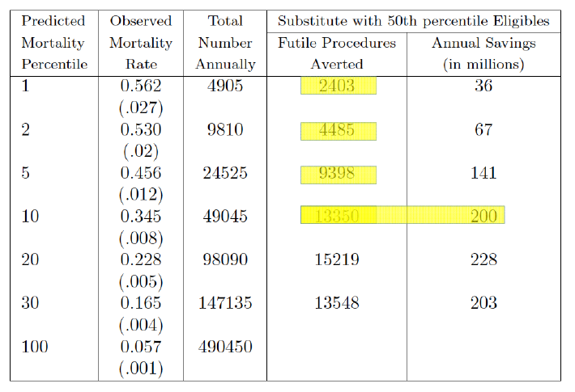
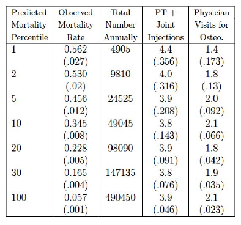
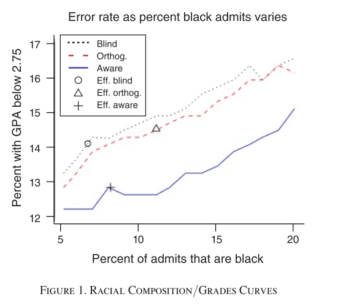
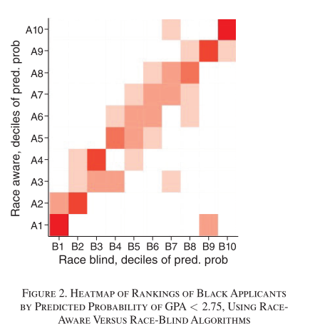

```{r packages, echo=FALSE, message=FALSE, warning=FALSE}

if (!require("pacman"))
  install.packages("pacman")

pacman::p_load(knitr,
               xaringan,
               RefManageR)

```

```{r setup, include=FALSE}
options(htmltools.dir.version = FALSE)

knitr::opts_chunk$set(eval = TRUE,
                      echo = TRUE,
                      warning = FALSE,
                      message = FALSE,
                      cache = FALSE)

htmltools::tagList(rmarkdown::html_dependency_font_awesome())
```

```{r, references, echo=FALSE, cache=FALSE}
BibOptions(check.entries = FALSE, 
           bib.style = "numeric", 
           cite.style = "authoryear", 
           style = "markdown",
           hyperlink = FALSE, 
           dashed = FALSE)
bib <- ReadBib("refs/refs.bib", check = FALSE)
```

# Outline

- [Prediction Policy Problems](#prediction)

- [Algorithmic Fairness](#fairness)


---
class: title-slide-section-blue, center, middle
name: prediction

# Prediction Policy Problems

---
# Motivation

Consider the following toy example from Kleinberg, Ludwig, Mullainathan, and Obermeyer (AER 2015):

- $Y=\{\text{rain},\text{no rain}\}$
- $X$ atmospheric conditions
- $D$ is a binary policy decision
- $\Pi(Y,D)$ payoff (utility)

The change in payoff resulting from a policy decision is given by

$$\underbrace{\frac{d\Pi(Y,D)}{dD}}_{\text{total effect of the decision}}
 \;=\;
 \underbrace{\left.\frac{\partial \Pi}{\partial D}\right|_{Y}}
           _{\substack{\text{direct / policy term}\\(\text{needs a *prediction* of }Y)}}
 \;+\;
 \underbrace{\frac{\partial \Pi}{\partial Y}\;
             \frac{\partial Y}{\partial D}}
           _{\substack{\text{indirect term}\\(\text{needs the *causal* effect of }D\text{ on }Y)}}$$


---
# Prediction-Policy Problems

$$\frac{d\Pi}{dD}
=
\underbrace{\left.\frac{\partial \Pi}{\partial D}\right|_{Y=\hat Y}}_{\text{direct (prediction)}}
+
\underbrace{\frac{\partial \Pi}{\partial Y}\,
            \frac{\partial Y}{\partial D}}_{\text{indirect (causal)}}$$

**Interpretation**

* The *direct* term asks: *If the outcome $Y$ were frozen at its forecast $\hat Y$, what is the marginal payoff of changing $D$?*  
  – needs accurate **prediction**, no causal ID.

* The *indirect* term multiplies how much an extra unit of $Y$ is worth $\bigl(\partial \Pi/\partial Y\bigr)$ by how $D$ *causes* $Y$ to move $\bigl(\partial Y/\partial D\bigr)$.  
  – needs **causal** evidence.


---
# Edge Cases vs. Reality


$$\frac{d\Pi}{dD}=\color{steelblue}{\underbrace{\left.\frac{\partial \Pi}{\partial D}\right|_{Y=\hat Y}}_{\text{direct (prediction)}}}+\color{darkorange}{\underbrace{\frac{\partial \Pi}{\partial Y}\,\frac{\partial Y}{\partial D}}_{\text{indirect (causal)}}}$$

* **Pure prediction**   $∂Y/∂D  =  0$
  – decision cannot move the outcome
  – *umbrella choice* (your umbrella won’t change the weather)

* **Pure causation**   $(∂Π/∂D)|_Y  =  0$
  – action matters *only* via its effect on Y
  – *vaccine dose* (ignoring side‑effects)

* **Most real decisions**: both terms ≠ 0 → need **good forecasts** *and* **causal evidence**


---

# Rain dance vs. umbrella 

```{r, echo=FALSE, out.width = "70%", fig.align='center'}



```


---
# Prediction-Policy Problems

In the past two lectures we focused on assessing policy with causal inference and treatment effects.

Some decisions, however, depend *only* on prediction (Kleinberg, Ludwig, Mullainathan & Obermeyer 2015):

- Which applicants will be **most effective teachers?** (hiring & promotion)  
- **How long will a worker stay unemployed?** (setting optimal savings)  
- **Which restaurants are likeliest to violate health codes?** (targeting inspections)  
- **Which youths face the highest risk of re-offending?** (allocating interventions)  
- **How credit-worthy is a loan applicant?** (approval decisions)

When the action cannot influence the outcome, causal methods add no value—the planner’s job is to forecast as accurately as possible.


---
# Real-world prediction-policy problem: Joint replacement

- 750,000 hip or knee replacements are performed in the United States each year.

- Benefits: substantial gains in mobility and pain relief.

- Costs: about $15,000 per procedure plus a painful, months-long recovery.

>**Working assumption:** the payoff, $\Pi$, from surgery rises with postoperative longevity, $Y$.

>**Key Question:** Using only information available before the operation, can we forecast which surgeries will be futile and redirect those resources?


---

# Joint replacement DAG

```{r, echo=FALSE, out.width = "30%", fig.align='center'}



```


_Note_: Kleinberg et al. (2015) abstract from surgical risk.


---
# Data

- A 20% sample of 7.4 million Medicare beneficiaries was analyzed; 98,090 individuals (1.3%) had a claim for joint replacement in 2010.

- Among these patients, 1.4% died within one month of surgery—likely due to complications—and an additional 4.2% died within the subsequent 1–12 months.

- The average mortality rate is approximately 5%. On average, surgeries are not futile.

- However, this average may be misleading. A more relevant question is whether surgeries performed on the predictably highest-risk patients were futile.

---
# Predicting mortality risk

Setup:

- **Outcome:** Mortality within 1–12 months post-surgery
- **Features:** Medicare claims data prior to joint replacement, including patient demographics (age, sex, geography); comorbidities, symptoms, injuries, acute conditions, and their progression over time; and healthcare utilization
- **Sample:** Training set: 65,000 observations; Test set: 33,000 observations
- **ML algorithm:** Lasso regression

The playbook:

- Rank test-set beneficiaries by model-predicted mortality risk percentiles
- Assign to each percentile its corresponding share of surgeries
- Demonstrate that the algorithm outperforms physician decision-making


---
# The riskiest people receiving joint replacement

.pull-left[
```{r, echo=FALSE, out.width = "60%", fig.align='center'}



```
_Source_: Kleinberg et al. (2015).


]
.pull-right[
How to read the table

- Col 1: Model-predicted mortality percentile (1 = riskiest 1 %).
- Col 2: Actual 12-month mortality for that percentile (standard errors in parentheses).
- Col 3: Number of joint-replacement surgeries performed each year in that bin.

Example: the top 1 % risk group received 4,905 surgeries, yet 56.2 % died within a year—so most of those operations were likely futile.
]

---
# Can an algorithm beat physicians?

**Econometric hurdle — selective-labels bias**  
We only observe post-operative mortality for people *who actually received a joint replacement*; the counterfactual outcome for untreated, yet eligible, patients is missing.

**Counterfactual construction**

1. Pull the pool of patients who satisfied Medicare eligibility but **did not** undergo surgery.  
2. Working assumption: surgeons schedule operations roughly in order of *increasing* risk (lowest-risk first).  
3. Reallocate a fixed number of surgeries from the highest-risk treated patients to the lowest-risk untreated eligibles and compare predicted mortality.

If this simulated swap lowers the expected death rate, the algorithm outperforms physician judgment.


---
# So, can the lasso beat physicians?


.pull-left[
```{r, echo=FALSE, out.width = "90%", fig.align='center'}



```
_Source_: Kleinberg et al. (2015).

*Simulation logic:* For each risk percentile, swap surgeries from the highest-risk treated patients with untreated, median-risk eligibles (50th percentile), holding total surgeries fixed.

]
.pull-right[
The table reports:
- Futile procedures averted (col 4) – operations reallocated away from patients with ≥50 % predicted 12-month mortality.
- Annual savings (col 5) – hospital costs avoided (≈ $15 k per surgery).

Key line: replacing the top 10 % risk group prevents 13,350 likely futile operations and saves $200m per year—evidence that the algorithm screens better than current physician judgement.
]


???

Note that the numbers that appear in this slide, taken from Susan Athey's presentation on "Policy Prediction Problems", are slightly different that those that appear in Kleinberg et al., (2015).

---
# What can still go wrong?

.pull-left[
**Econometric Concern #2 — Omitted Payoff Bias**
Physicians might observe benefits—such as pain relief—that are not captured in our data.

**Testing the Hypothesis**  
Use proxies for post-operative pain relief:
- Physical therapy (PT) and joint injection claims
- Follow-up visits for osteoarthritis

Empirically, these proxies are flat across predicted risk percentiles.
High-mortality patients do not appear to experience greater pain relief 
⇒ Reallocating their surgeries is unlikely to reduce welfare.
]

.pull-right[


```{r, echo=FALSE, out.width="90%", fig.align='center'}

```

]


---
#Leveling the Playing Field

To fairly compare physicians (or any human experts) with a machine learning model, both must operate under identical inputs and incentives:

- **Same information** – access to the full pre-decision dataset
- **Same objective** – a shared payoff or loss function
- **Same constraints** – identical budgetary, temporal, and policy limitations

>Only after aligning these conditions can we meaningfully ask:
Who allocates resources more effectively?

---
# Key take-aways

- A more accurate model does not automatically lead to better decisions.
Alignment with payoffs and real-world constraints is essential.

- Selective-labels and omitted-payoff bias can obscure algorithmic gains—or generate illusory ones.

- Robust policy design requires marrying machine learning with social science:
incentives, fairness, and welfare metrics must guide implementation.


---
class: title-slide-section-blue, center, middle
name: fairness

# Algorithmic Fairness


---

# Blind Algorithms

Algorithmic Fairness (Kleinberg, Ludwig, Mullainathan, and Rambachan, AER 2018): 

Can we increase algorithmic fairness by ignoring variables that induce such bias such as race, age, sex, etc.?

Short answer: Not necessarily.


---

# The basic setup

The context: Student admission to college.

Data: $\{Y_i, X_i, R_i\}_{i=1}^N$, where
- $Y_i$ is performance
- $X_i$ is a set of features
- $R_i$ is a binary race indicator where $R_i=1$ for individuals that belong to the minority group and $R_i=0$ otherwise.

Predictors:

- __"Aware"__: $\hat{f}(X_i,R_i)$

- __"Blind"__: $\hat{f}(X_i)$

- __"Orthogonality"__: $\hat{f}(\widetilde{X}_i)$, where $\widetilde{X}_i \perp R_i$.

---

# Definitions

Let $S$ denote the set of admitted students and $\phi(S)$ denote a function that depends only on the predicted performance, measured by $\hat{f}$, of the students in $S$.

__Compatibility condition:__ If $S$ and $S^\prime$ are two sets of students of the same size, sorted in descending order of predicted performance $\widehat{f}(X,R)$, and the predicted performance of the $i^\text{th}$ student in $S$ is at least as large as the predicted performance of the $i^\text{th}$ in $S^\prime$ for all $i$, then $\phi(S)\geq\phi(S^\prime)$.

Intuition: if every member of class $S$ is no worse on paper than the counterpart in $S^\prime$, any planner who claims to care only about student performance shouldn’t prefer $S^\prime$.


- The _efficient_ planner maximizes $\phi(S)$ where $\phi(S)$ is compatible with $\hat{f}$.

- The _equitable_ planner seeks to maximize $\phi(S)+\gamma(S)$, where $\phi(S)$ is compatible with $\hat{f}$, and $\gamma(S)$ is monotonically increasing in the number of students in $S$ who have $R=1$.


---

# Main result: Keep $R$ in


Kleinberg et al. (2018) main result:

> THEOREM 1: _For some choice of $K_0$ and $K_1$ with $K_0 + K_1 = K$, the equitable planner’s problem can be optimized by choosing the $K_0$ applicants in the $R = 0$ group with the highest $\widehat{f}(X,R)$, and the $K_1$ applicants in the $R=1$ group with the highest $\widehat{f}(X,R)$._


(See Kleinberg et al., 2018 for a sketch of the proof.)

**In words:** If you want both quality and a fair share of minority students, first decide how many seats each group should get, then simply admit the highest-scoring people within each group—using the race-aware score.

---

# Intuition

- Good ranking of applicants is desired for both types of planners.

- Equitable planners still care about ranking _within_ groups.

- Achieving a more balanced  acceptance  rate is a _post_ prediction step. Can be adjusted by changing the group-wise threshold.


---

# Illustration of the result

Say that we have $10$ open slots, $100$ admissions from the majority group $(R=0)$ and $20$ form the minority group $(R=1)$. In addition, assume that the acceptance rate for the minority group is set to $30\%$.

An equitable planner should:
1. Rank candidates within each group according to $\widehat{f}(X_i,R_i)$.

2. Accept the top $7$ from the $R=0$ group, and top $3$ from the $R=1$ group.


---

# Empirical application

.pull-left[

__DATA: __Panel data on This representative sample of students who entered eighth grade in the fall of 1988, and who were then followed up in 1990, 1992, 1994, and mid-20s).

__OUTCOME:__ GPA $\geq$ 2.75.

__FEATURES:__ High school grades, course taking patterns, extracurricular activities, standardized test scores, etc.

__RACE:__ White $(N_0=4,274)$ and black $(N_1=469)$.

__PREDICTORS:__ OLS (random forest for robustness)

]
.pull-right[

__RESULT:__ The "aware" predictor dominates for both efficient planner and equitable planner.

```{r, echo=FALSE, out.width = "100%", fig.align='center'}



```
]

---

# Sources of disagreement

.pull-left[

- On the right: The distribution of black students in the sample across predicted-outcome deciles according to the race-blind or race-aware predictors.


- How to read this: In the case of agreement between race-blind and race-aware, the values would be aligned on the main diagonal. By contrast, disagreement is characterized by off-diagonal non-zero values.

- Bottom line (again): Adding race to the equation improves within group ranking.

]
.pull-right[


```{r, echo=FALSE, out.width = "90%", fig.align='center'}



```
]

---

# Main takeaways

- Turning algorithms blind might actually do harm.

- What actually matters is the rankings within groups.

- Caveat: This is a very specific setup and source of bias.

---
class: .title-slide-final, center, inverse, middle

# `slides |> end()`

[<i class="fa fa-github"></i> Source code](https://github.com/ml4econ/lecture-notes-2025/tree/master/12-prediction-policy)  


---
# Selected references


Angwin, Julia, Jeff Larson, Surya Mattu, and Lauren Kirchner. 2016. “Machine Bias.” _ProPublica_, May 23. [https://www.propublica.org/article/machine-bias-risk-assessments-in-criminal-sentencing.](https://www.propublica.org/article/machine-bias-risk-assesments-in-criminal-sentencing.)

Athey, S. (2018). The Impact of Machine Learning on Economics. 

Athey, S., & Wager, S. (2018). Efficient Policy Learning.

Kleinberg, B. J., Ludwig, J., Mullainathan, S., & Obermeyer, Z. (2015). Prediction Policy Problems. _American Economic Review: Papers & Proceedings_, 105(5), 491–495.

Kleinberg, B. J., Ludwig, J., Mullainathan, S., & Rambachan, A. (2018). Algorithmic Fairness. _American Economic Review: Papers & Proceedings_, 108, 22–27.

---
# Selected references


Kleinberg, J., Lakkaraju, H., Leskovec, J., Ludwig, J., & Mullainathan, S. (2018). Human Descisions and Machine Predictions. _Quarterly Journal of Economics_, 133(1), 237–293.

Kleinberg, J., Mullainathan, S., & Raghavan, M. (2017). Inherent Trade-Offs in the Fair Determination of Risk Scores. _Proceedings of the 8th Conference on Innovation in Theoretical Computer Science_, 43, 1–23.

Mullainathan, S., & Spiess, J. (2017). Machine Learning: An Applied Econometric Approach. _Journal of Economic Perspectives_, 31(2), 87–106.

